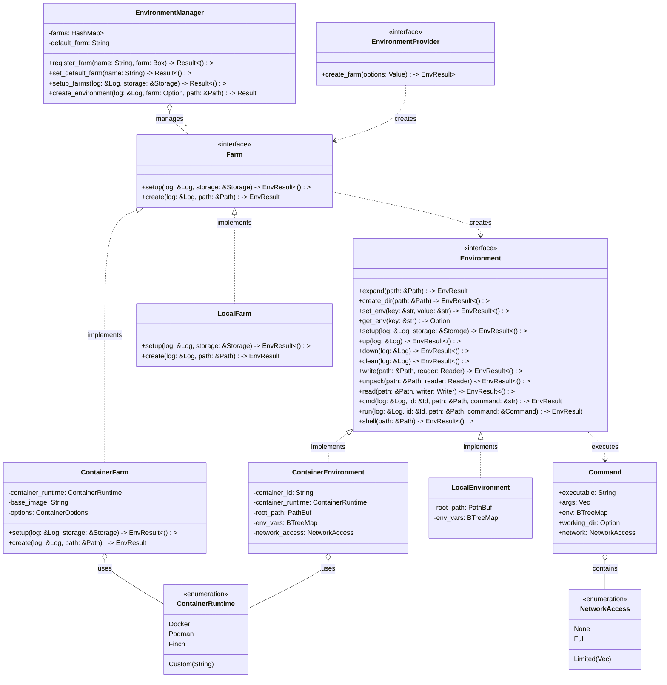

# Edo Environment Component - Detailed Design

## 1. Overview

The Environment component is one of Edo's four core architectural pillars and represents a critical differentiator from other build systems. This component provides flexible, pluggable control over where and how builds execute, enabling precise environment configuration while maintaining reproducibility.

## 2. Core Responsibilities

The Environment component is responsible for:

1. **Environment Management**: Creating, configuring, and managing build environments
2. **Isolation Control**: Providing configurable isolation between builds and the host system
3. **File System Operations**: Handling file and directory operations within environments
4. **Command Execution**: Running build commands in isolated contexts
5. **Resource Management**: Controlling resource allocation for build environments
6. **Platform Abstraction**: Providing a consistent interface across different environment types

## 3. Component Architecture

### 3.1 Key Abstractions

#### 3.1.1 Farm

The `Farm` trait represents a factory for creating build environments:

```rust
trait Farm {
    /// Setup can be used for any one time initializations required for an environment farm
    fn setup(&self, log: &Log, storage: &Storage) -> EnvResult<()>;

    /// Create a new environment using this farm
    fn create(&self, log: &Log, path: &Path) -> EnvResult<Environment>;
}
```

Key characteristics:
- **Environment Factory**: Creates environment instances with consistent configurations
- **One-time Setup**: Handles initialization of resources needed by all environments
- **Stateless Design**: Farms themselves maintain minimal state

#### 3.1.2 Environment

The `Environment` trait represents the core abstraction for build environments:

```rust
trait Environment {
    /// Expand the provided path to a root absolute path inside of the environment
    fn expand(&self, path: &Path) -> EnvResult<PathBuf>;

    /// Create a directory inside the environment
    fn create_dir(&self, path: &Path) -> EnvResult<()>;

    /// Set environment variable
    fn set_env(&self, key: &str, value: &str) -> EnvResult<()>;

    /// Get an environment variable
    fn get_env(&self, key: &str) -> Option<String>;

    /// Setup the environment for execution
    fn setup(&self, log: &Log, storage: &Storage) -> EnvResult<()>;

    /// Spin the environment up
    fn up(&self, log: &Log) -> EnvResult<()>;

    /// Spin the environment down
    fn down(&self, log: &Log) -> EnvResult<()>;

    /// Clean the environment
    fn clean(&self, log: &Log) -> EnvResult<()>;

    /// Write a file into the environment from a given reader
    fn write(&self, path: &Path, reader: Reader) -> EnvResult<()>;

    /// Unpack an archive into the environment from a given reader
    fn unpack(&self, path: &Path, reader: Reader) -> EnvResult<()>;

    /// Read or archive a path in the environment to a given writer
    fn read(&self, path: &Path, writer: Writer) -> EnvResult<()>;

    /// Run a single command in the environment
    fn cmd(&self, log: &Log, id: &Id, path: &Path, command: &str) -> EnvResult<bool>;

    /// Run a deferred command in the environment
    fn run(&self, log: &Log, id: &Id, path: &Path, command: &Command) -> EnvResult<bool>;

    /// Open a shell in the environment
    fn shell(&self, path: &Path) -> EnvResult<()>;
}
```

Key capabilities:
- **Lifecycle Management**: Setup, start, stop, and clean operations
- **File System Operations**: Path resolution, directory creation, file I/O
- **Environment Variables**: Configuration of build environment variables
- **Command Execution**: Running commands within the environment
- **Interactive Access**: Opening shells for debugging and exploration

#### 3.1.3 Command

The `Command` structure represents a series of commands to be executed in an environment with template-based variable substitution. This provides a powerful abstraction for building complex command sequences with dynamic values:

```rust
#[derive(Clone)]
pub struct Command {
    id: Id,
    env: Environment,
    log: Log,
    interpreter: String,
    commands: Vec<String>,
    variables: HashMap<String, String>,
}

impl Command {
    pub fn new(log: &Log, id: &Id, env: &Environment) -> Self {
        Self {
            id: id.clone(),
            env: env.clone(),
            log: log.clone(),
            interpreter: "bash".into(),
            commands: Vec::new(),
            variables: HashMap::new(),
        }
    }

    pub fn set_interpreter(&mut self, interpreter: &str) {
        self.interpreter = interpreter.to_string();
    }

    pub fn set(&mut self, key: &str, value: &str) -> EnvResult<()> {
        let value = self.sub(value)?;
        self.variables.insert(key.to_string(), value);
        Ok(())
    }

    fn sub(&self, line: &str) -> EnvResult<String> {
        let current = line.to_string();
        let hg = Handlebars::new();

        hg.render_template(current.as_str(), &self.variables)
            .context(error::TemplateSnafu)
    }

    pub fn chdir(&mut self, path: &str) -> EnvResult<()> {
        self.commands.push(format!("cd {}", self.sub(path)?));
        Ok(())
    }

    pub fn pushd(&mut self, path: &str) -> EnvResult<()> {
        self.commands.push(format!("pushd {}", self.sub(path)?));
        Ok(())
    }

    pub fn popd(&mut self) {
        self.commands.push("popd".into());
    }

    pub async fn create_named_dir(&mut self, key: &str, path: &str) -> EnvResult<()> {
        let path = self.sub(path)?;
        let result = self.env.expand(Path::new(path.as_str())).await?;
        self.variables
            .insert(key.to_string(), result.to_string_lossy().to_string());
        self.commands.push(format!("mkdir -p {path}"));
        Ok(())
    }

    pub async fn create_dir(&mut self, path: &str) -> EnvResult<()> {
        let path = self.sub(path)?;
        self.commands.push(format!("mkdir -p {path}"));
        Ok(())
    }

    pub async fn remove_dir(&mut self, path: &str) -> EnvResult<()> {
        let path = self.sub(path)?;
        self.commands.push(format!("rm -r {path}"));
        Ok(())
    }

    pub async fn remove_file(&mut self, path: &str) -> EnvResult<()> {
        let path = self.sub(path)?;
        self.commands.push(format!("rm {path}"));
        Ok(())
    }

    pub async fn mv(&mut self, from: &str, to: &str) -> EnvResult<()> {
        let from = self.sub(from)?;
        let to = self.sub(to)?;
        self.commands.push(format!("mv {from} {to}"));
        Ok(())
    }

    pub async fn copy(&mut self, from: &str, to: &str) -> EnvResult<()> {
        let from = self.sub(from)?;
        let to = self.sub(to)?;
        self.commands.push(format!("cp -r {from} {to}"));
        Ok(())
    }

    pub async fn run(&mut self, cmd: &str) -> EnvResult<()> {
        let cmd = self.sub(cmd)?;
        self.commands.push(cmd);
        Ok(())
    }

    pub async fn send(&self, path: &str) -> EnvResult<()> {
        let path = self.sub(path)?;
        let dir = self.env.expand(Path::new(path.as_str())).await?;
        let status = self.env.run(&self.log, &self.id, &dir, self).await?;
        ensure!(status, error::RunSnafu);
        Ok(())
    }
}
```

Key characteristics:

- **Command Aggregation**: Represents a series of commands that can be built up over time and executed as a batch
- **Templating System**: Uses Handlebars templating for variable substitution in commands
- **Environment Integration**: Tightly integrated with Environment for execution context
- **Shell Script Generation**: Formats commands as a shell script with a chosen interpreter (bash by default)

The Command implementation provides methods for:

1. **Script Configuration**:
   - `set_interpreter`: Change the script interpreter (default: bash)
   - `set`: Define variables for template substitution

2. **Directory Operations**:
   - `chdir`: Change directory within the script
   - `pushd`/`popd`: Push/pop directory onto/from stack
   - `create_dir`: Create a directory
   - `create_named_dir`: Create a directory and store its path as a variable
   - `remove_dir`: Remove a directory

3. **File Operations**:
   - `remove_file`: Delete a file
   - `mv`: Move/rename files or directories
   - `copy`: Copy files or directories

4. **Command Execution**:
   - `run`: Add a command to the execution queue
   - `send`: Execute the accumulated commands in the environment

When executed, the Command generates a shell script that includes all accumulated commands and variable definitions, which is then executed within the target environment.

#### 3.1.4 NetworkAccess

The `NetworkAccess` enum controls network connectivity for environments:

```rust
#[derive(Clone, Debug, PartialEq, Eq)]
pub enum NetworkAccess {
    /// No network access
    None,

    /// Full network access
    Full,

    /// Access to specific hosts
    Limited(Vec<String>),
}
```

### 3.2 Component Structure



## 4. Key Interfaces

### 4.1 Farm Interface

```rust
/// Defines the interface that implementations of an environment farm must support
pub trait Farm: Send + Sync + 'static {
    /// Setup can be used for any one time initializations required for an environment farm
    fn setup(&self, log: &Log, storage: &Storage) -> EnvResult<()>;

    /// Create a new environment using this farm
    fn create(&self, log: &Log, path: &Path) -> EnvResult<Environment>;
}
```

The Farm trait defines a factory pattern for creating environments with specific configurations. Key responsibilities include:

1. **One-time Setup**: Initialization of resources shared across environment instances
2. **Environment Creation**: Instantiation of environment instances with consistent configurations
3. **Resource Management**: Efficient management of shared resources

### 4.2 Environment Interface

```rust
/// Defines the interface that implementations of an environment must support
pub trait Environment: Send + Sync + 'static {
    /// Expand the provided path to a root absolute path inside of the environment
    fn expand(&self, path: &Path) -> EnvResult<PathBuf>;

    /// Create a directory inside the environment
    fn create_dir(&self, path: &Path) -> EnvResult<()>;

    /// Set environment variable
    fn set_env(&self, key: &str, value: &str) -> EnvResult<()>;

    /// Get an environment variable
    fn get_env(&self, key: &str) -> Option<String>;

    /// Setup the environment for execution
    fn setup(&self, log: &Log, storage: &Storage) -> EnvResult<()>;

    /// Spin the environment up
    fn up(&self, log: &Log) -> EnvResult<()>;

    /// Spin the environment down
    fn down(&self, log: &Log) -> EnvResult<()>;

    /// Clean the environment
    fn clean(&self, log: &Log) -> EnvResult<()>;

    /// Write a file into the environment from a given reader
    fn write(&self, path: &Path, reader: Reader) -> EnvResult<()>;

    /// Unpack an archive into the environment from a given reader
    fn unpack(&self, path: &Path, reader: Reader) -> EnvResult<()>;

    /// Read or archive a path in the environment to a given writer
    fn read(&self, path: &Path, writer: Writer) -> EnvResult<()>;

    /// Run a single command in the environment
    fn cmd(&self, log: &Log, id: &Id, path: &Path, command: &str) -> EnvResult<bool>;

    /// Run a deferred command in the environment
    fn run(&self, log: &Log, id: &Id, path: &Path, command: &Command) -> EnvResult<bool>;

    /// Open a shell in the environment
    fn shell(&self, path: &Path) -> EnvResult<()>;
}
```

The Environment trait defines the core interface for interacting with build environments. Its methods can be grouped into several categories:

1. **Lifecycle Methods**:
   - `setup`: Prepares the environment for use
   - `up`: Activates/starts the environment
   - `down`: Deactivates/stops the environment
   - `clean`: Removes temporary files and resources

2. **File System Operations**:
   - `expand`: Resolves paths within the environment
   - `create_dir`: Creates directories
   - `write`: Writes files from a reader
   - `unpack`: Extracts archives
   - `read`: Reads files to a writer

3. **Environment Configuration**:
   - `set_env`: Sets environment variables
   - `get_env`: Retrieves environment variables

4. **Command Execution**:
   - `cmd`: Executes simple commands
   - `run`: Executes complex commands with additional configuration
   - `shell`: Opens an interactive shell for debugging

### 4.3 WebAssembly Plugin Interface (WIT)

```wit
// environment-provider.wit
package edo:environment;

interface environment-provider {
    // Error type for environment operations
    enum env-error {
        init-failed,
        create-failed,
        exec-failed,
        io-error,
        not-supported,
        invalid-config,
    }

    // Type alias for environment results
    type env-result<T> = result<T, env-error>;

    // Network access modes
    enum network-access {
        none,
        full,
        limited(list<string>),
    }

    // Environment options
    record environment-options {
        working-dir: string,
        network: network-access,
        mount-tmp: bool,
        env-vars: list<tuple<string, string>>,
        resource-limits: option<resource-limits>,
    }

    // Resource limits configuration
    record resource-limits {
        cpu-cores: option<u32>,
        memory-mb: option<u32>,
        disk-mb: option<u32>,
    }

    // Container specific options
    record container-options {
        image: string,
        runtime: string,
        volumes: list<tuple<string, string>>,
        privileged: bool,
    }

    // Initialize the environment provider
    init: func(options: string) -> env-result<_>;

    // Create an environment
    create-environment: func(env-options: environment-options) -> env-result<string>;

    // Start an environment
    start: func(env-id: string) -> env-result<_>;

    // Stop an environment
    stop: func(env-id: string) -> env-result<_>;

    // Execute a command in the environment
    execute: func(env-id: string, command: string, args: list<string>, work-dir: string) -> env-result<i32>;

    // Write a file to the environment
    write-file: func(env-id: string, path: string, content: list<u8>) -> env-result<_>;

    // Read a file from the environment
    read-file: func(env-id: string, path: string) -> env-result<list<u8>>;
}
```

## 5. Implementation Details

### 5.1 Environment Manager

The Environment Manager orchestrates the creation and management of environments:

```rust
pub struct EnvironmentManager {
    farms: HashMap<String, Box<dyn Farm>>,
    default_farm: String,
}

impl EnvironmentManager {
    pub fn new() -> Self {
        let mut manager = Self {
            farms: HashMap::new(),
            default_farm: "local".to_string(),
        };

        // Register default local farm
        let local_farm = Box::new(LocalFarm::new());
        manager.register_farm("local".to_string(), local_farm).unwrap();

        manager
    }

    pub fn register_farm(&mut self, name: String, farm: Box<dyn Farm>) -> Result<()> {
        if self.farms.contains_key(&name) {
            return error::DuplicateFarmSnafu { name }.fail();
        }

        self.farms.insert(name, farm);
        Ok(())
    }

    pub fn set_default_farm(&mut self, name: String) -> Result<()> {
        if !self.farms.contains_key(&name) {
            return error::UnknownFarmSnafu { name }.fail();
        }

        self.default_farm = name;
        Ok(())
    }

    pub async fn setup_farms(&self, log: &Log, storage: &Storage) -> Result<()> {
        for (name, farm) in &self.farms {
            log.info(format!("Setting up farm: {}", name));
            farm.setup(log, storage).await?;
        }

        Ok(())
    }

    pub async fn create_environment(
        &self,
        log: &Log,
        farm: Option<String>,
        path: &Path,
    ) -> Result<Box<dyn Environment>> {
        let farm_name = farm.unwrap_or_else(|| self.default_farm.clone());

        let farm = self.farms.get(&farm_name).ok_or_else(|| {
            error::UnknownFarmSnafu {
                name: farm_name.clone(),
            }
            .build()
        })?;

        log.info(format!("Creating environment using farm: {}", farm_name));
        let env = farm.create(log, path).await?;

        Ok(env)
    }
}
```

### 5.2 Environment Implementations

#### 5.2.1 Local Environment

```rust
pub struct LocalFarm {
    temp_dir: PathBuf,
}

impl Farm for LocalFarm {
    async fn setup(&self, _log: &Log, _storage: &Storage) -> EnvResult<()> {
        // Create temp directory if it doesn't exist
        if !self.temp_dir.exists() {
            std::fs::create_dir_all(&self.temp_dir)?;
        }

        Ok(())
    }

    async fn create(&self, log: &Log, path: &Path) -> EnvResult<Box<dyn Environment>> {
        let root_path = if path.is_absolute() {
            path.to_path_buf()
        } else {
            self.temp_dir.join(path)
        };

        // Ensure directory exists
        if !root_path.exists() {
            log.debug(format!("Creating directory: {:?}", root_path));
            std::fs::create_dir_all(&root_path)?;
        }

        Ok(Box::new(LocalEnvironment {
            root_path,
            env_vars: BTreeMap::new(),
        }))
    }
}

pub struct LocalEnvironment {
    root_path: PathBuf,
    env_vars: BTreeMap<String, String>,
}

impl Environment for LocalEnvironment {
    async fn expand(&self, path: &Path) -> EnvResult<PathBuf> {
        if path.is_absolute() {
            Ok(path.to_path_buf())
        } else {
            Ok(self.root_path.join(path))
        }
    }

    async fn create_dir(&self, path: &Path) -> EnvResult<()> {
        let full_path = self.expand(path).await?;
        std::fs::create_dir_all(full_path)?;
        Ok(())
    }

    async fn set_env(&self, key: &str, value: &str) -> EnvResult<()> {
        self.env_vars.insert(key.to_string(), value.to_string());
        Ok(())
    }

    async fn get_env(&self, key: &str) -> Option<String> {
        self.env_vars.get(key).cloned().or_else(|| std::env::var(key).ok())
    }

    async fn setup(&self, _log: &Log, _storage: &Storage) -> EnvResult<()> {
        // Local environment doesn't need special setup
        Ok(())
    }

    async fn up(&self, _log: &Log) -> EnvResult<()> {
        // Local environment is always up
        Ok(())
    }

    async fn down(&self, _log: &Log) -> EnvResult<()> {
        // Local environment doesn't need to be brought down
        Ok(())
    }

    async fn clean(&self, log: &Log) -> EnvResult<()> {
        log.info(format!("Cleaning directory: {:?}", self.root_path));

        // Remove all files but keep the directory
        for entry in std::fs::read_dir(&self.root_path)? {
            let entry = entry?;
            let path = entry.path();

            if path.is_dir() {
                std::fs::remove_dir_all(path)?;
            } else {
                std::fs::remove_file(path)?;
            }
        }

        Ok(())
    }

    async fn write(&self, path: &Path, mut reader: Reader) -> EnvResult<()> {
        let full_path = self.expand(path).await?;

        // Ensure parent directory exists
        if let Some(parent) = full_path.parent() {
            std::fs::create_dir_all(parent)?;
        }

        let mut file = std::fs::File::create(full_path)?;
        std::io::copy(&mut reader, &mut file)?;

        Ok(())
    }

    async fn unpack(&self, path: &Path, reader: Reader) -> EnvResult<()> {
        let full_path = self.expand(path).await?;

        // Ensure directory exists
        std::fs::create_dir_all(&full_path)?;

        // Extract archive based on format
        // Implementation would handle different archive types
        unpack_archive(reader, &full_path)?;

        Ok(())
    }

    async fn read(&self, path: &Path, mut writer: Writer) -> EnvResult<()> {
        let full_path = self.expand(path).await?;

        let mut file = std::fs::File::open(full_path)?;
        std::io::copy(&mut file, &mut writer)?;

        Ok(())
    }

    async fn cmd(&self, log: &Log, id: &Id, path: &Path, command: &str) -> EnvResult<bool> {
        let full_path = self.expand(path).await?;

        // Split command into program and args
        let parts: Vec<&str> = command.split_whitespace().collect();
        if parts.is_empty() {
            return Ok(false);
        }

        let program = parts[0];
        let args = &parts[1..];

        // Build command
        let mut cmd = std::process::Command::new(program);
        cmd.args(args)
           .current_dir(full_path)
           .envs(self.env_vars.clone());

        // Execute command
        log.info(format!("Executing: {} {}", program, args.join(" ")));
        let status = cmd.status()?;

        Ok(status.success())
    }

    async fn run(&self, log: &Log, id: &Id, path: &Path, command: &Command) -> EnvResult<bool> {
        let full_path = if let Some(working_dir) = &command.working_dir {
            self.expand(working_dir).await?
        } else {
            self.expand(path).await?
        };

        // Build command
        let mut cmd = std::process::Command::new(&command.executable);
        cmd.args(&command.args)
           .current_dir(full_path)
           .envs(self.env_vars.clone())
           .envs(&command.env);

        // Execute command
        log.info(format!(
            "Executing: {} {}",
            command.executable,
            command.args.join(" ")
        ));
        let status = cmd.status()?;

        Ok(status.success())
    }

    async fn shell(&self, path: &Path) -> EnvResult<()> {
        let full_path = self.expand(path).await?;

        // Determine shell to use
        let shell = if cfg!(windows) {
            "cmd.exe"
        } else {
            std::env::var("SHELL").unwrap_or_else(|_| "/bin/sh".to_string())
        };

        // Launch interactive shell
        let mut cmd = std::process::Command::new(shell);
        cmd.current_dir(full_path)
           .envs(self.env_vars.clone())
           .status()?;

        Ok(())
    }
}
```

#### 5.2.2 Container Environment

```rust
pub struct ContainerFarm {
    runtime: ContainerRuntime,
    base_image: String,
    options: ContainerOptions,
    temp_dir: PathBuf,
}

impl Farm for ContainerFarm {
    async fn setup(&self, log: &Log, storage: &Storage) -> EnvResult<()> {
        // Create temp directory if it doesn't exist
        if !self.temp_dir.exists() {
            std::fs::create_dir_all(&self.temp_dir)?;
        }

        // Pull container image if needed
        log.info(format!("Ensuring container image is available: {}", self.base_image));
        self.runtime.pull_image(&self.base_image).await?;

        Ok(())
    }

    async fn create(&self, log: &Log, path: &Path) -> EnvResult<Box<dyn Environment>> {
        let root_path = if path.is_absolute() {
            path.to_path_buf()
        } else {
            self.temp_dir.join(path)
        };

        // Ensure directory exists
        if !root_path.exists() {
            log.debug(format!("Creating directory: {:?}", root_path));
            std::fs::create_dir_all(&root_path)?;
        }

        // Generate a unique container ID
        let container_id = format!("edo-{}", uuid::Uuid::new_v4());

        Ok(Box::new(ContainerEnvironment {
            container_id,
            runtime: self.runtime.clone(),
            base_image: self.base_image.clone(),
            root_path,
            options: self.options.clone(),
            env_vars: BTreeMap::new(),
            network_access: NetworkAccess::None, // Default to no network
        }))
    }
}

pub struct ContainerEnvironment {
    container_id: String,
    runtime: ContainerRuntime,
    base_image: String,
    root_path: PathBuf,
    options: ContainerOptions,
    env_vars: BTreeMap<String, String>,
    network_access: NetworkAccess,
}

impl Environment for ContainerEnvironment {
    async fn expand(&self, path: &Path) -> EnvResult<PathBuf> {
        if path.is_absolute() {
            // Map to container path
            let rel_path = path.strip_prefix("/").unwrap_or(path);
            Ok(PathBuf::from("/").join(rel_path))
        } else {
            // Map to relative path in container work dir
            Ok(PathBuf::from("/work").join(path))
        }
    }

    async fn create_dir(&self, path: &Path) -> EnvResult<()> {
        let container_path = self.expand(path).await?;

        // Execute mkdir in container
        self.runtime.exec_command(
            &self.container_id,
            "mkdir",
            &["-p", container_path.to_str().unwrap()]
        ).await?;

        Ok(())
    }

    async fn set_env(&self, key: &str, value: &str) -> EnvResult<()> {
        self.env_vars.insert(key.to_string(), value.to_string());
        Ok(())
    }

    async fn get_env(&self, key: &str) -> Option<String> {
        self.env_vars.get(key).cloned()
    }

    async fn setup(&self, log: &Log, _storage: &Storage) -> EnvResult<()> {
        log.info(format!("Setting up container environment: {}", self.container_id));

        // Create container but don't start it yet
        self.runtime.create_container(
            &self.container_id,
            &self.base_image,
            &self.root_path,
            &self.options
        ).await?;

        Ok(())
    }

    async fn up(&self, log: &Log) -> EnvResult<()> {
        log.info(format!("Starting container: {}", self.container_id));

        // Set up network based on configuration
        let network_config = match &self.network_access {
            NetworkAccess::None => "--network none",
            NetworkAccess::Full => "",
            NetworkAccess::Limited(hosts) => {
                // Implementation would handle setting up limited network access
                // This is simplified for the design document
                "--network limited"
            }
        };

        // Start the container
        self.runtime.start_container(
            &self.container_id,
            network_config
        ).await?;

        Ok(())
    }

    async fn down(&self, log: &Log) -> EnvResult<()> {
        log.info(format!("Stopping container: {}", self.container_id));

        // Stop the container
        self.runtime.stop_container(&self.container_id).await?;

        Ok(())
    }

    async fn clean(&self, log: &Log) -> EnvResult<()> {
        log.info(format!("Cleaning container: {}", self.container_id));

        // Remove the container
        self.runtime.remove_container(&self.container_id).await?;

        Ok(())
    }

    async fn write(&self, path: &Path, reader: Reader) -> EnvResult<()> {
        let container_path = self.expand(path).await?;

        // Ensure parent directory exists
        if let Some(parent) = container_path.parent() {
            self.runtime.exec_command(
                &self.container_id,
                "mkdir",
                &["-p", parent.to_str().unwrap()]
            ).await?;
        }

        // Write file to container
        self.runtime.copy_to_container(
            &self.container_id,
            reader,
            container_path.to_str().unwrap()
        ).await?;

        Ok(())
    }

    async fn unpack(&self, path: &Path, reader: Reader) -> EnvResult<()> {
        let container_path = self.expand(path).await?;

        // Ensure directory exists
        self.runtime.exec_command(
            &self.container_id,
            "mkdir",
            &["-p", container_path.to_str().unwrap()]
        ).await?;

        // Copy archive to temporary location in container
        let temp_archive = format!("/tmp/archive-{}.tar", uuid::Uuid::new_v4());
        self.runtime.copy_to_container(
            &self.container_id,
            reader,
            &temp_archive
        ).await?;

        // Extract archive in container
        self.runtime.exec_command(
            &self.container_id,
            "tar",
            &["-xf", &temp_archive, "-C", container_path.to_str().unwrap()]
        ).await?;

        // Clean up temporary archive
        self.runtime.exec_command(
            &self.container_id,
            "rm",
            &["-f", &temp_archive]
        ).await?;

        Ok(())
    }

    async fn read(&self, path: &Path, writer: Writer) -> EnvResult<()> {
        let container_path = self.expand(path).await?;

        // Read file from container
        self.runtime.copy_from_container(
            &self.container_id,
            container_path.to_str().unwrap(),
            writer
        ).await?;

        Ok(())
    }

    async fn cmd(&self, log: &Log, id: &Id, path: &Path, command: &str) -> EnvResult<bool> {
        let container_path = self.expand(path).await?;

        // Split command into program and args
        let parts: Vec<&str> = command.split_whitespace().collect();
        if parts.is_empty() {
            return Ok(false);
        }

        let program = parts[0];
        let args = &parts[1..];

        // Execute command in container
        log.info(format!("Executing in container: {} {}", program, args.join(" ")));

        let result = self.runtime.exec_command_with_env(
            &self.container_id,
            program,
            args,
            container_path.to_str().unwrap(),
            &self.env_vars
        ).await?;

        Ok(result == 0)
    }

    async fn run(&self, log: &Log, id: &Id, path: &Path, command: &Command) -> EnvResult<bool> {
        let container_path = if let Some(working_dir) = &command.working_dir {
            self.expand(working_dir).await?
        } else {
            self.expand(path).await?
        };

        // Combine environment variables
        let mut env_vars = self.env_vars.clone();
        env_vars.extend(command.env.clone());

        // Execute command in container
        log.info(format!(
            "Executing in container: {} {}",
            command.executable,
            command.args.join(" ")
        ));

        let result = self.runtime.exec_command_with_env(
            &self.container_id,
            &command.executable,
            &command.args.iter().map(|s| s.as_str()).collect::<Vec<_>>(),
            container_path.to_str().unwrap(),
            &env_vars
        ).await?;

        Ok(result == 0)
    }

    async fn shell(&self, path: &Path) -> EnvResult<()> {
        let container_path = self.expand(path).await?;

        // Open interactive shell in container
        self.runtime.exec_interactive(
            &self.container_id,
            "/bin/sh",
            &[],
            container_path.to_str().unwrap()
        ).await?;

        Ok(())
    }
}
```

### 5.3 Container Runtime Abstraction

```rust
#[derive(Clone, Debug)]
pub enum ContainerRuntime {
    Docker,
    Podman,
    Finch,
    Custom(String),
}

impl ContainerRuntime {
    async fn pull_image(&self, image: &str) -> EnvResult<()> {
        match self {
            Self::Docker => docker_pull(image).await?,
            Self::Podman => podman_pull(image).await?,
            Self::Finch => finch_pull(image).await?,
            Self::Custom(runtime) => custom_pull(runtime, image).await?,
        }

        Ok(())
    }

    async fn create_container(
        &self,
        container_id: &str,
        image: &str,
        mount_path: &Path,
        options: &ContainerOptions,
    ) -> EnvResult<()> {
        match self {
            Self::Docker => docker_create(container_id, image, mount_path, options).await?,
            Self::Podman => podman_create(container_id, image, mount_path, options).await?,
            Self::Finch => finch_create(container_id, image, mount_path, options).await?,
            Self::Custom(runtime) => custom_create(runtime, container_id, image, mount_path, options).await?,
        }

        Ok(())
    }

    async fn start_container(&self, container_id: &str, network_config: &str) -> EnvResult<()> {
        match self {
            Self::Docker => docker_start(container_id, network_config).await?,
            Self::Podman => podman_start(container_id, network_config).await?,
            Self::Finch => finch_start(container_id, network_config).await?,
            Self::Custom(runtime) => custom_start(runtime, container_id, network_config).await?,
        }

        Ok(())
    }

    async fn stop_container(&self, container_id: &str) -> EnvResult<()> {
        match self {
            Self::Docker => docker_stop(container_id).await?,
            Self::Podman => podman_stop(container_id).await?,
            Self::Finch => finch_stop(container_id).await?,
            Self::Custom(runtime) => custom_stop(runtime, container_id).await?,
        }

        Ok(())
    }

    async fn remove_container(&self, container_id: &str) -> EnvResult<()> {
        match self {
            Self::Docker => docker_rm(container_id).await?,
            Self::Podman => podman_rm(container_id).await?,
            Self::Finch => finch_rm(container_id).await?,
            Self::Custom(runtime) => custom_rm(runtime, container_id).await?,
        }

        Ok(())
    }

    async fn exec_command(
        &self,
        container_id: &str,
        program: &str,
        args: &[&str],
    ) -> EnvResult<i32> {
        match self {
            Self::Docker => docker_exec(container_id, program, args, "/", &BTreeMap::new()).await,
            Self::Podman => podman_exec(container_id, program, args, "/", &BTreeMap::new()).await,
            Self::Finch => finch_exec(container_id, program, args, "/", &BTreeMap::new()).await,
            Self::Custom(runtime) => custom_exec(runtime, container_id, program, args, "/", &BTreeMap::new()).await,
        }
    }

    async fn exec_command_with_env(
        &self,
        container_id: &str,
        program: &str,
        args: &[&str],
        work_dir: &str,
        env_vars: &BTreeMap<String, String>,
    ) -> EnvResult<i32> {
        match self {
            Self::Docker => docker_exec(container_id, program, args, work_dir, env_vars).await,
            Self::Podman => podman_exec(container_id, program, args, work_dir, env_vars).await,
            Self::Finch => finch_exec(container_id, program, args, work_dir, env_vars).await,
            Self::Custom(runtime) => custom_exec(runtime, container_id, program, args, work_dir, env_vars).await,
        }
    }

    async fn exec_interactive(
        &self,
        container_id: &str,
        program: &str,
        args: &[&str],
        work_dir: &str,
    ) -> EnvResult<()> {
        match self {
            Self::Docker => docker_exec_interactive(container_id, program, args, work_dir).await?,
            Self::Podman => podman_exec_interactive(container_id, program, args, work_dir).await?,
            Self::Finch => finch_exec_interactive(container_id, program, args, work_dir).await?,
            Self::Custom(runtime) => custom_exec_interactive(runtime, container_id, program, args, work_dir).await?,
        }

        Ok(())
    }

    async fn copy_to_container(
        &self,
        container_id: &str,
        reader: Reader,
        dest_path: &str,
    ) -> EnvResult<()> {
        match self {
            Self::Docker => docker_copy_to(container_id, reader, dest_path).await?,
            Self::Podman => podman_copy_to(container_id, reader, dest_path).await?,
            Self::Finch => finch_copy_to(container_id, reader, dest_path).await?,
            Self::Custom(runtime) => custom_copy_to(runtime, container_id, reader, dest_path).await?,
        }

        Ok(())
    }

    async fn copy_from_container(
        &self,
        container_id: &str,
        src_path: &str,
        writer: Writer,
    ) -> EnvResult<()> {
        match self {
            Self::Docker => docker_copy_from(container_id, src_path, writer).await?,
            Self::Podman => podman_copy_from(container_id, src_path, writer).await?,
            Self::Finch => finch_copy_from(container_id, src_path, writer).await?,
            Self::Custom(runtime) => custom_copy_from(runtime, container_id, src_path, writer).await?,
        }

        Ok(())
    }
}
```

## 6. Security Considerations

### 6.1 Network Isolation

The Environment component implements strict network isolation for container-based environments by default:

1. **Default No Network**: Container environments start with no network access
2. **Explicit Configuration**: Network access must be explicitly granted
3. **Granular Control**: Support for allowing access to specific hosts only

### 6.2 Resource Limits

Resource constraints can be applied to environments to prevent runaway processes:

1. **CPU Limits**: Restrict CPU core usage
2. **Memory Limits**: Cap memory consumption
3. **Disk Quota**: Limit disk space usage

### 6.3 Filesystem Isolation

The Environment component provides filesystem isolation to protect the host system:

1. **Restricted Access**: Container environments only see mounted directories
2. **Read-only Mounts**: Support for read-only access to sensitive directories
3. **Temporary Filesystems**: Use of tmpfs for sensitive operations

## 7. Error Handling

```rust
/// Type alias for environment operation results
pub type EnvResult<T> = Result<T, EnvError>;

/// Environment error types
#[derive(Debug, Snafu)]
pub enum EnvError {
    /// Farm not found
    #[snafu(display("Unknown farm: {}", name))]
    UnknownFarm { name: String },

    /// Duplicate farm registration
    #[snafu(display("Duplicate farm name: {}", name))]
    DuplicateFarm { name: String },

    /// Environment initialization failed
    #[snafu(display("Failed to initialize environment: {}", reason))]
    InitializationFailed { reason: String },

    /// Command execution failed
    #[snafu(display("Command execution failed: {}", reason))]
    CommandFailed { reason: String },

    /// I/O error
    #[snafu(display("I/O error: {}", source))]
    IoError { source: std::io::Error },

    /// Container runtime error
    #[snafu(display("Container runtime error: {}", reason))]
    ContainerError { reason: String },

    /// Network configuration error
    #[snafu(display("Network configuration error: {}", reason))]
    NetworkError { reason: String },

    /// Environment not running
    #[snafu(display("Environment not running"))]
    NotRunning,

    /// Operation not supported
    #[snafu(display("Operation not supported: {}", operation))]
    NotSupported { operation: String },
}
```

## 8. Testing Strategy

Testing for the Environment component will focus on:

1. **Unit Tests**:
   - Test each environment implementation in isolation
   - Verify file operations, command execution, and lifecycle management
   - Test error handling and edge cases

2. **Integration Tests**:
   - Test interaction between environments and other components
   - Verify build operations in different environment types
   - Test plugin extensions for custom environments

3. **Container Tests**:
   - Test container creation, management, and isolation
   - Verify network isolation configurations
   - Test resource constraints

4. **Mock Tests**:
   - Use mock container runtimes for testing without dependencies
   - Simulate different container behaviors and failure modes

## 9. Future Enhancements

### 9.1 Remote Environments

Support for executing builds on remote machines:

1. **SSH-based Environments**: Run builds on remote systems via SSH
2. **Cluster Environments**: Distribute builds across compute clusters
3. **Cloud Environments**: Leverage cloud compute resources for builds

### 9.2 Enhanced Sandboxing

More advanced sandboxing capabilities:

1. **User Namespace Isolation**: Fine-grained user namespace mapping
2. **Seccomp Profiles**: Custom security profiles for containers
3. **AppArmor/SELinux Integration**: Enhanced security policies

### 9.3 Environment Templates

Reusable environment configurations:

1. **Environment Libraries**: Shareable environment definitions
2. **Predefined Templates**: Common build environments for different languages
3. **Environment Composition**: Combining multiple environment aspects

### 9.4 Persistent Environments

Support for persistent build environments:

1. **Environment Pooling**: Reuse environments across builds
2. **Environment Warm-up**: Pre-initialize environments for faster startup
3. **Environment Caching**: Cache environment state for incremental builds

## 10. Conclusion

The Environment component is a critical differentiator for Edo, providing flexible, pluggable control over build environments. By separating environment management from build execution, Edo enables precise configuration of build environments while maintaining reproducibility and security.

The design presented here supports Edo's goal of giving developers control over where and how builds happen, addressing key limitations in existing build tools. The component's extensibility through plugins ensures that Edo can adapt to diverse build requirements and evolving containerization technologies.
