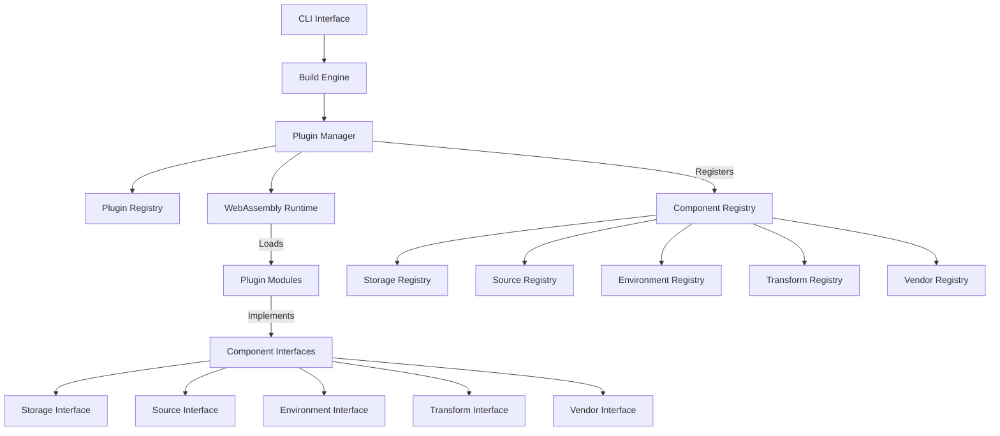

# Edo Plugin System Design

## 1. Overview

The Plugin System is a core architectural feature of Edo that enables extensibility across all components through WebAssembly. This design document details how plugins are structured, discovered, loaded, and executed within the Edo build system.

## 2. Core Objectives

1. **Component Extensibility**: Allow extension of all core components (Storage, Source, Environment, Transform)
2. **Multi-implementation Support**: Enable a single plugin to provide multiple implementations of different components
3. **Language Agnosticism**: Support plugins written in any language that compiles to WebAssembly
4. **Security**: Provide a secure sandboxed execution environment for plugins
5. **Discoverability**: Enable easy discovery and registration of plugins
6. **Versioning**: Support plugin versioning and compatibility checks

## 3. Architecture Overview

### 3.1 Plugin System Components



### 3.2 Key Abstractions

#### 3.2.1 Plugin

A Plugin represents a WebAssembly module that can provide one or more implementations of Edo component interfaces:

```rust
pub struct Plugin {
    id: String,
    version: Version,
    module: Module,
    instance: Instance,
    exports: HashMap<String, Vec<String>>,
}
```

#### 3.2.2 Plugin Manager

The Plugin Manager handles plugin discovery, loading, and registration:

```rust
pub struct PluginManager {
    registry: PluginRegistry,
    component_registry: ComponentRegistry,
    runtime: WasmRuntime,
}
```

#### 3.2.3 Plugin Registry

The Plugin Registry maintains a catalog of available plugins:

```rust
pub struct PluginRegistry {
    plugins: HashMap<String, Plugin>,
}
```

#### 3.2.4 Component Registry

The Component Registry tracks available implementations for each component type:

```rust
pub struct ComponentRegistry {
    storage_backends: HashMap<String, Box<dyn StorageBackend>>,
    sources: HashMap<String, Box<dyn Source>>,
    environments: HashMap<String, Box<dyn Environment>>,
    transforms: HashMap<String, Box<dyn Transform>>,
    vendors: HashMap<String, Box<dyn Vendor>>,
}
```

## 4. Plugin Discovery and Loading

### 4.1 Plugin Declaration

Plugins are declared in Starlark build files using the `plugin` function:

```starlark
plugin(
    name = "my-plugin",
    kind = "wasm",
    source = ["//vendor:my-plugin-1.0.0.wasm"],
)
```

### 4.2 Plugin Resolution

1. The build engine parses plugin declarations from Starlark files
2. Each plugin's source is resolved using the Source component
3. The WASM binary is fetched and stored in the local cache

### 4.3 Plugin Loading

1. The plugin's WebAssembly module is loaded into the runtime
2. The module is instantiated with access to host functions
3. The plugin exports are discovered and registered

## 5. Interface Design

The plugin system uses WebAssembly Interface Types (WIT) to define component interfaces. Instead of a single monolithic interface, we'll organize the interfaces into logical components while maintaining the ability for a single plugin to implement multiple interfaces.

### 5.1 Package Structure

```wit
// edo.wit - Package definition
package edo:plugin@1.0.0;

// Component interfaces
interface common { ... }
interface storage { ... }
interface source { ... }
interface environment { ... }
interface transform { ... }
interface vendor { ... }

// Host interface
interface host { ... }

// Plugin ABI
interface abi {
  use host.{ ... };

  // Multiple implementations in one plugin
  create-storage: func(addr: string, node: borrow<node>, ctx: borrow<context>) -> result<backend, error>;
  create-farm: func(addr: string, node: borrow<node>, ctx: borrow<context>) -> result<farm, error>;
  create-source: func(addr: string, node: borrow<node>, ctx: borrow<context>) -> result<source, error>;
  create-transform: func(addr: string, node: borrow<node>, ctx: borrow<context>) -> result<transform, error>;
  create-vendor: func(addr: string, node: borrow<node>, ctx: borrow<context>) -> result<vendor, error>;
}

// World definition
world edo {
  use host.{ ... };
  import host;
  export abi;
}
```

### 5.2 Common Interface

The common interface defines shared types and functionality:

```wit
// common.wit
interface common {
  // Error handling
  resource error {
    constructor(plugin: string, message: string);
    to-string: func() -> string;
  }

  // Logging
  info: func(message: string);
  warn: func(message: string);
  fatal: func(message: string);

  // Artifact ID
  resource id {
    constructor(name: string, digest: string, version: option<string>, pkg: option<string>, arch: option<string>);
    name: func() -> string;
    digest: func() -> string;
    set-digest: func(digest: string);
    version: func() -> option<string>;
    set-version: func(input: string);
    clear-version: func();
    pkg: func() -> option<string>;
    arch: func() -> option<string>;
    from-string: static func(input: string) -> id;
  }

  // Config node handling
  resource node {
    validate-keys: func(keys: list<string>) -> result<_, error>;
    as-bool: func() -> option<bool>;
    as-int: func() -> option<s64>;
    as-float: func() -> option<f64>;
    as-string: func() -> option<string>;
    as-version: func() -> option<string>;
    as-require: func() -> option<string>;
    as-list: func() -> option<list<node>>;
    as-table: func() -> option<list<tuple<string, node>>>;
    get-id: func() -> option<string>;
    get-kind: func() -> option<string>;
    get-name: func() -> option<string>;
    get-table: func() -> option<list<tuple<string, node>>>;
  }

  // Context for plugin operations
  resource context {
    get-arg: func(name: string) -> option<string>;
    get-handle: func() -> handle;
    config: func() -> config;
    storage: func() -> storage;
    get-transform: func(addr: string) -> option<transform>;
    get-farm: func(addr: string) -> option<farm>;
    add-source: func(addr: string, node: borrow<node>) -> result<source, error>;
  }

  // I/O
  resource reader {
    read: func(size: u64) -> result<list<u8>, error>;
  }

  resource writer {
    write: func(data: list<u8>) -> result<u64, error>;
  }
}
```

### 5.3 Storage Interface

```wit
// storage.wit
interface storage {
  use common.{ id, error, reader, writer };

  // Layer representation
  resource layer {
    media-type: func() -> string;
    digest: func() -> string;
    size: func() -> u64;
    platform: func() -> option<string>;
  }

  // Artifact configuration
  resource artifact-config {
    constructor(id: borrow<id>, provides: list<string>, metadata: option<string>);
    id: func() -> id;
    provides: func() -> list<string>;
    requires: func() -> list<tuple<string, list<tuple<string, string>>>>;
    add-requirement: func(group: string, name: string, version: string);
  }

  // Artifact representation
  resource artifact {
    constructor(config: borrow<artifact-config>);
    config: func() -> artifact-config;
    layers: func() -> list<layer>;
    add-layer: func(layer: borrow<layer>);
  }

  // Storage backend interface
  resource backend {
    ls: func() -> result<list<id>, error>;
    has: func(id: borrow<id>) -> result<bool, error>;
    open: func(id: borrow<id>) -> result<artifact, error>;
    save: func(artifact: borrow<artifact>) -> result<_, error>;
    del: func(id: borrow<id>) -> result<_, error>;
    copy: func(source: borrow<id>, target: borrow<id>) -> result<_, error>;
    prune: func(id: borrow<id>) -> result<_, error>;
    prune-all: func() -> result<_, error>;
    read: func(layer: borrow<layer>) -> result<reader, error>;
    start-layer: func() -> result<writer, error>;
    finish-layer: func(media-type: string, platform: option<string>, writer: borrow<writer>) -> result<layer, error>;
  }

  // Storage manager interface (host-provided)
  resource storage-manager {
    open: func(id: borrow<id>) -> result<artifact, error>;
    read: func(layer: borrow<layer>) -> result<reader, error>;
    start-layer: func() -> result<writer, error>;
    finish-layer: func(media-type: string, platform: option<string>, writer: borrow<writer>) -> result<layer, error>;
    save: func(artifact: borrow<artifact>) -> result<_, error>;
  }
}
```

### 5.4 Source Interface

```wit
// source.wit
interface source {
  use common.{ id, error, node, context };
  use storage.{ artifact, storage-manager };

  // Source interface
  resource source {
    get-unique-id: func() -> result<id, error>;
    fetch: func(log: borrow<log>, storage: borrow<storage-manager>) -> result<artifact, error>;
    stage: func(log: borrow<log>, storage: borrow<storage-manager>, env: borrow<environment>, path: string) -> result<_, error>;
  }

  // Vendor interface
  resource vendor {
    get-options: func(name: string) -> result<list<string>, error>;
    resolve: func(name: string, version: string) -> result<node, error>;
    get-dependencies: func(name: string, version: string) -> result<option<list<tuple<string, string>>>, error>;
  }

  // Log interface
  resource log {
    write: func(message: list<u8>) -> result<u64, error>;
  }
}
```

### 5.5 Environment Interface

```wit
// environment.wit
interface environment {
  use common.{ error, reader, writer, id };
  use source.{ log };
  use storage.{ storage-manager };

  // Command interface
  resource command {
    set: func(key: string, value: string) -> result<_, error>;
    chdir: func(path: string) -> result<_, error>;
    pushd: func(path: string) -> result<_, error>;
    popd: func();
    create-named-dir: func(key: string, path: string) -> result<_, error>;
    create-dir: func(path: string) -> result<_, error>;
    remove-dir: func(path: string) -> result<_, error>;
    remove-file: func(path: string) -> result<_, error>;
    mv: func(source: string, target: string) -> result<_, error>;
    copy: func(source: string, target: string) -> result<_, error>;
    run: func(cmd: string) -> result<_, error>;
    send: func(path: string) -> result<_, error>;
  }

  // Environment interface
  resource environment {
    defer-cmd: func(log: borrow<log>, id: borrow<id>) -> command;
    expand: func(path: string) -> result<string, error>;
    create-dir: func(path: string) -> result<_, error>;
    set-env: func(key: string, value: string) -> result<_, error>;
    get-env: func(key: string) -> option<string>;
    setup: func(log: borrow<log>, storage: borrow<storage-manager>) -> result<_, error>;
    up: func(log: borrow<log>) -> result<_, error>;
    down: func(log: borrow<log>) -> result<_, error>;
    clean: func(log: borrow<log>) -> result<_, error>;
    write: func(path: string, data: borrow<reader>) -> result<_, error>;
    unpack: func(path: string, data: borrow<reader>) -> result<_, error>;
    read: func(path: string, writer: borrow<writer>) -> result<_, error>;
    cmd: func(log: borrow<log>, id: borrow<id>, path: string, command: string) -> result<bool, error>;
    run: func(log: borrow<log>, id: borrow<id>, path: string, command: borrow<command>) -> result<bool, error>;
    shell: func(path: string) -> result<_, error>;
  }

  // Farm interface
  resource farm {
    setup: func(log: borrow<log>, storage: borrow<storage-manager>) -> result<_, error>;
    create: func(log: borrow<log>, path: string) -> result<environment, error>;
  }
}
```

### 5.6 Transform Interface

```wit
// transform.wit
interface transform {
  use common.{ id, error };
  use source.{ log };
  use storage.{ artifact, storage-manager };
  use environment.{ environment };

  // Handle for transform operations
  resource handle {
    storage: func() -> storage-manager;
    get: func(addr: string) -> option<transform>;
  }

  // Transform status
  variant transform-status {
    success(artifact),
    retryable(tuple<option<string>, error>),
    failed(tuple<option<string>, error>)
  }

  // Transform interface
  resource transform {
    environment: func() -> result<string, error>;
    depends: func() -> result<list<string>, error>;
    get-unique-id: func(ctx: borrow<handle>) -> result<id, error>;
    prepare: func(log: borrow<log>, ctx: borrow<handle>) -> result<_, error>;
    stage: func(log: borrow<log>, ctx: borrow<handle>, env: borrow<environment>) -> result<_, error>;
    transform: func(log: borrow<log>, ctx: borrow<handle>, env: borrow<environment>) -> transform-status;
    can-shell: func() -> bool;
    shell: func(env: borrow<environment>) -> result<_, error>;
  }
}
```

### 5.7 Host Interface

The host interface provides access to Edo's core functionality from plugins:

```wit
// host.wit
interface host {
  use common.{ id, error, node, context, reader, writer };
  use storage.{ artifact, layer, artifact-config, storage-manager };
  use source.{ log };
  use environment.{ environment, command, farm };
  use transform.{ transform, handle, transform-status };

  // Config access
  resource config {
    get: func(name: string) -> option<node>;
  }

  // Host-provided utility functions
  info: func(message: string);
  warn: func(message: string);
  fatal: func(message: string);
}
```

### 5.8 Plugin ABI Interface

The ABI interface defines the entry points for creating component implementations:

```wit
// abi.wit
interface abi {
  use common.{ node, error, context };
  use storage.{ backend };
  use source.{ source, vendor };
  use environment.{ farm };
  use transform.{ transform };

  // Create component implementations
  create-storage: func(addr: string, node: borrow<node>, ctx: borrow<context>) -> result<backend, error>;
  create-farm: func(addr: string, node: borrow<node>, ctx: borrow<context>) -> result<farm, error>;
  create-source: func(addr: string, node: borrow<node>, ctx: borrow<context>) -> result<source, error>;
  create-transform: func(addr: string, node: borrow<node>, ctx: borrow<context>) -> result<transform, error>;
  create-vendor: func(addr: string, node: borrow<node>, ctx: borrow<context>) -> result<vendor, error>;
}
```

## 6. Plugin Implementation

### 6.1 Plugin Instance

Each plugin instance consists of:

1. **WebAssembly Module**: The compiled code
2. **Capabilities**: Defined permissions for the plugin
3. **Exports**: The component implementations provided by the plugin
4. **State**: Any persistent state maintained by the plugin

### 6.2 Example Plugin Implementation (Rust)

```rust
use edo_plugin::{abi, common, storage, source, environment, transform};

struct MyStorageBackend {
    // Implementation details
}

impl storage::Backend for MyStorageBackend {
    // Implement storage backend methods
}

struct MySourceProvider {
    // Implementation details
}

impl source::Source for MySourceProvider {
    // Implement source provider methods
}

// Export plugin entry points
#[export_name = "create-storage"]
fn create_storage(addr: &str, node: &common::Node, ctx: &common::Context) -> Result<storage::Backend, common::Error> {
    // Initialize and return a storage backend
    Ok(MyStorageBackend::new(addr, node, ctx))
}

#[export_name = "create-source"]
fn create_source(addr: &str, node: &common::Node, ctx: &common::Context) -> Result<source::Source, common::Error> {
    // Initialize and return a source provider
    Ok(MySourceProvider::new(addr, node, ctx))
}

// No implementation for other component types
#[export_name = "create-farm"]
fn create_farm(_addr: &str, _node: &common::Node, _ctx: &common::Context) -> Result<environment::Farm, common::Error> {
    Err(common::Error::new("my-plugin", "Farm implementation not available"))
}

#[export_name = "create-transform"]
fn create_transform(_addr: &str, _node: &common::Node, _ctx: &common::Context) -> Result<transform::Transform, common::Error> {
    Err(common::Error::new("my-plugin", "Transform implementation not available"))
}

#[export_name = "create-vendor"]
fn create_vendor(_addr: &str, _node: &common::Node, _ctx: &common::Context) -> Result<source::Vendor, common::Error> {
    Err(common::Error::new("my-plugin", "Vendor implementation not available"))
}
```

## 7. Plugin Lifecycle

The lifecycle of a plugin includes:

### 7.1 Discovery

1. Plugin declarations are parsed from Starlark build files
2. The Plugin Manager catalogs available plugins
3. Plugin sources are resolved using the Source component

### 7.2 Loading

1. The plugin WASM binary is fetched to local storage
2. The WebAssembly runtime loads and validates the module
3. The module is instantiated with access to host functions
4. Available exports are discovered and registered

### 7.3 Initialization

1. Each component implementation is initialized with its configuration
2. The implementation is registered with the appropriate component registry
3. The plugin's capabilities are configured based on its requirements

### 7.4 Execution

1. Component registries dispatch calls to the appropriate implementation
2. The WebAssembly runtime handles memory isolation and resource limits
3. Results are passed back to the Edo core

### 7.5 Unloading

1. When a build is complete, plugin resources can be released
2. Long-lived plugins may remain loaded for future builds

## 8. Security Model

The Plugin System employs several security measures:

### 8.1 Isolation

WebAssembly provides strong isolation guarantees:
- Memory isolation prevents access to host memory
- Function imports limit accessible APIs
- No direct file system or network access

### 8.2 Capability-Based Security

Plugins operate under a capability-based security model:
- Access only to explicitly granted capabilities
- No ambient authority
- Limited view of the host system

### 8.3 Resource Limits

The WebAssembly runtime enforces resource limits:
- Memory consumption limits
- Execution time limits
- Call stack depth limits

### 8.4 Interface Safety

The WIT interface provides type safety:
- Strong typing prevents many common vulnerabilities
- No unsafe memory access
- Validated parameter passing

## 9. Plugin Discovery and Registration

### 9.1 Plugin Declaration in Starlark

Plugins are declared in Starlark build files:

```starlark
plugin(
    name = "s3-storage",
    kind = "wasm",
    source = ["//vendor:s3-storage-1.0.0.wasm"],
)

storage_backend(
    name = "my-s3-backend",
    plugin = "s3-storage",
    bucket = "my-build-artifacts",
    region = "us-west-2",
)
```

### 9.2 Plugin Registration Flow

1. The build engine parses plugin declarations
2. The Plugin Manager resolves and loads the plugin
3. Component implementations are registered with their respective registries
4. Component instances are created from the registered implementations

### 9.3 Plugin Configuration

Plugins can receive configuration through Starlark rules:

```starlark
# Plugin declaration
plugin(
    name = "docker-env",
    kind = "wasm",
    source = ["//vendor:docker-env-1.2.0.wasm"],
)

# Plugin configuration and use
environment_farm(
    name = "docker",
    plugin = "docker-env",
    image = "ubuntu:20.04",
    network = "none",
    mounts = {
        "/cache": "//local:cache",
    },
)
```

## 10. Implementation Considerations

### 10.1 Plugin Development Experience

To facilitate plugin development:
- Provide SDK libraries for common languages (Rust, C, C++, Go)
- Create template projects for new plugins
- Implement testing tools for plugin validation
- Develop documentation and examples

### 10.2 Plugin Distribution

Plugins can be distributed through:
- Local file system
- Git repositories
- Package registries
- Custom plugin registries

### 10.3 Plugin Versioning

Plugin versioning follows semver principles:
- Plugins specify their interface compatibility
- Edo validates plugin interface compatibility at load time
- Version conflicts are reported clearly to users

### 10.4 Performance Considerations

The WebAssembly runtime introduces some overhead:
- Just-in-time compilation minimizes runtime overhead
- Caching compiled modules improves subsequent load times
- Critical operations can be optimized with native implementations

## 11. Example Use Cases

### 11.1 Custom Storage Backend

```starlark
# Define a plugin that implements an S3 storage backend
plugin(
    name = "s3-storage",
    kind = "wasm",
    source = ["//vendor:s3-storage-1.0.0.wasm"],
)

# Configure an S3 storage backend instance
storage_backend(
    name = "my-build-cache",
    plugin = "s3-storage",
    bucket = "my-build-artifacts",
    region = "us-west-2",
    prefix = "builds/",
)

# Use the storage backend in a build
build_config(
    name = "default",
    build_cache = "my-build-cache",
)
```

### 11.2 Custom Environment Farm

```starlark
# Define a plugin that implements a Docker environment farm
plugin(
    name = "docker-env",
    kind = "wasm",
    source = ["//vendor:docker-env-1.2.0.wasm"],
)

# Configure a Docker environment farm
environment_farm(
    name = "ubuntu-build",
    plugin = "docker-env",
    image = "ubuntu:20.04",
    packages = ["build-essential", "cmake", "python3"],
    env = {
        "DEBIAN_FRONTEND": "noninteractive",
    },
)

# Use the environment in a transform
cpp_build(
    name = "my-app",
    srcs = ["//src:*.cpp"],
    environment = "ubuntu-build",
)
```

### 11.3 Custom Transform

```starlark
# Define a plugin that implements a specialized build process
plugin(
    name = "rust-wasm",
    kind = "wasm",
    source = ["//vendor:rust-wasm-0.9.0.wasm"],
)

# Configure a Rust WebAssembly build
rust_wasm_build(
    name = "my-wasm-component",
    srcs = ["//src/wasm:*.rs"],
    target = "wasm32-unknown-unknown",
    wasi = True,
    opt_level = "s",
)
```

## 12. Future Considerations

### 12.1 Plugin Marketplace

A centralized repository for sharing and discovering plugins:
- Searchable catalog of plugins
- Versioning and compatibility information
- Ratings and reviews
- Automated testing and validation

### 12.2 Component Model Integration

As the WebAssembly Component Model matures:
- Migrate to component-model-based interfaces
- Support composition of plugin components
- Leverage enhanced linking capabilities

### 12.3 Enhanced Security Features

Additional security features may include:
- Fine-grained capability control
- Plugin signature verification
- Runtime monitoring and policy enforcement
- Security auditing for plugins

### 12.4 Cross-Language Development

Improved tooling for plugin development in multiple languages:
- Better language bindings generation
- Consistent development experience across languages
- Testing frameworks for all supported languages
- Performance optimization guides

## 13. Conclusion

The Edo Plugin System provides a flexible, secure, and performant mechanism for extending the build system's capabilities. By using WebAssembly and a well-defined interface system, it enables developers to create custom implementations of core components while maintaining the security and reliability of the overall system. The modular design allows for incremental adoption and continuous evolution of the plugin ecosystem.
