# Edo Source Component - Detailed Design

## 1. Overview

The Source component is one of Edo's four core architectural pillars, responsible for managing the acquisition of external code and artifacts for the build system. This component ensures reproducible builds by providing a consistent, verifiable way to fetch dependencies from various origins and integrating with the Storage component for artifact persistence.

## 2. Core Responsibilities

The Source component is responsible for:

1. **Source Acquisition**: Fetching external code and artifacts from various locations
2. **Dependency Resolution**: Resolving version constraints for external dependencies
3. **Vendor Management**: Handling different external sources through a pluggable system
4. **Source Caching**: Working with the Storage component to cache source artifacts
5. **Build Reproducibility**: Ensuring consistent, reproducible source acquisition
6. **Environment Integration**: Staging sources into build environments

## 3. Component Architecture

### 3.1 Key Abstractions

#### 3.1.1 Source

The `Source` trait represents the core abstraction for obtaining external artifacts:

```rust
trait Source {
    /// The unique id for this source
    async fn get_unique_id(&self) -> SourceResult<Id>;

    /// Fetch the given source to storage
    async fn fetch(&self, log: &Log, storage: &Storage) -> SourceResult<Artifact>;

    /// Stage the source into the given environment and path
    async fn stage(&self, log: &Log, storage: &Storage, env: &Environment, path: &Path) -> SourceResult<()>;

    /// Check the cache if this source already exists, and only if it does not
    /// call fetch to get the artifact. Use this in most cases instead of calling
    /// fetch() as fetch will ALWAYS repull the source.
    async fn cache(&self, log: &Log, storage: &Storage) -> SourceResult<Artifact>;
}
```

Key capabilities of `Source`:
- **Unique Identity**: Each source can generate a unique identifier
- **Fetch Operation**: Retrieve the source and store it in the Storage component
- **Caching**: Smart retrieval that prioritizes cached artifacts
- **Environment Integration**: Stage source artifacts into build environments

#### 3.1.2 Vendor

The `Vendor` trait represents external providers of source artifacts with dependency resolution support:

```rust
trait Vendor {
    /// Get all versions of a given package/source name
    async fn get_options(&self, name: &str) -> VendorResult<HashSet<Version>>;

    /// Resolve a given name and version into a valid source node
    async fn resolve(&self, name: &str, version: &Version) -> VendorResult<Node>;

    /// Get all dependency requirements for a given name and version
    async fn get_dependencies(&self, name: &str, version: &Version) -> VendorResult<Option<HashMap<String, VersionReq>>>;
}
```

Key capabilities of `Vendor`:
- **Version Discovery**: Find available versions of a package
- **Package Resolution**: Convert a package name and version to a concrete source
- **Dependency Information**: Retrieve dependency requirements for packages

#### 3.1.3 Resolver

The `Resolver` is responsible for resolving complex dependency graphs:

```rust
#[derive(Clone, Default)]
pub struct Resolver {
    pool: Arc<Pool<EdoVersionSet>>,
    name_to_vs: DashMap<NameId, Set>,
    vendors: DashMap<String, Vendor>,
}
```

Key characteristics:
- **Multi-vendor**: Supports multiple vendors with different package ecosystems
- **Version Resolution**: Handles version constraint satisfaction
- **Conflict Resolution**: Resolves dependency conflicts
- **Generated Lock File**: Produces deterministic dependency lock files

#### 3.1.4 Dependency

The `Dependency` structure represents a version-constrained dependency on an external package:

```rust
struct Dependency {
    addr: Addr,              // Location in the build graph
    name: String,            // Package name
    version: VersionReq,     // Version requirement
    vendor: Option<String>,  // Optional vendor specification
}
```

### 3.2 Component Structure

```mermaid
classDiagram
    class SourceManager {
        +register_vendor(name: &str, vendor: Vendor) -> Result<()>
        +register_source(address: &Addr, source: Source) -> Result<()>
        +resolve_dependencies(requires: Vec<Dependency>) -> Result<HashMap<Addr, (String, String, Version)>>
        +fetch_source(address: &Addr) -> SourceResult<Artifact>
        +stage_source(address: &Addr, env: &Environment, path: &Path) -> SourceResult<()>
    }

    class Source {
        <<interface>>
        +get_unique_id() -> SourceResult<Id>
        +fetch(log: &Log, storage: &Storage) -> SourceResult<Artifact>
        +stage(log: &Log, storage: &Storage, env: &Environment, path: &Path) -> SourceResult<()>
        +cache(log: &Log, storage: &Storage) -> SourceResult<Artifact>
    }

    class Vendor {
        <<interface>>
        +get_options(name: &str) -> VendorResult<HashSet<Version>>
        +resolve(name: &str, version: &Version) -> VendorResult<Node>
        +get_dependencies(name: &str, version: &Version) -> VendorResult<Option<HashMap<String, VersionReq>>>
    }

    class Resolver {
        -pool: Arc<Pool<EdoVersionSet>>
        -name_to_vs: DashMap<NameId, Set>
        -vendors: DashMap<String, Vendor>
        +resolve(requires: Vec<Dependency>) -> Result<HashMap<Addr, (String, String, Version)>>
        +add_vendor(name: &str, vendor: Vendor)
        +build_db(name: &str) -> Result<()>
        -build_requirement(node: &Dependency) -> Result<Requirement>
    }

    class Storage {
        +fetch_source(id: &Id) -> StorageResult<Option<Artifact>>
        +safe_open(id: &Id) -> StorageResult<Artifact>
        +safe_save(artifact: &Artifact) -> StorageResult<()>
    }

    class Environment {
        +ensure_dir(path: &Path) -> EnvResult<()>
        +write_file(path: &Path, content: &[u8]) -> EnvResult<()>
        +extract_archive(archive: &Path, dest: &Path) -> EnvResult<()>
    }

    class Dependency {
        +addr: Addr
        +name: String
        +version: VersionReq
        +vendor: Option<String>
    }

    class SourceRegistry {
        -sources: HashMap<Addr, Source>
        +register(addr: &Addr, source: Source) -> Result<()>
        +get(addr: &Addr) -> Option<Source>
    }

    class VendorRegistry {
        -vendors: HashMap<String, Vendor>
        +register(name: &str, vendor: Vendor) -> Result<()>
        +get(name: &str) -> Option<Vendor>
    }

    class DependencyLock {
        +version: String
        +entries: HashMap<Addr, ResolvedDependency>
        +save(path: &Path) -> Result<()>
        +load(path: &Path) -> Result<Self>
    }

    class ResolvedDependency {
        +vendor: String
        +name: String
        +version: Version
        +digest: String
    }

    class SourceProvider {
        <<interface>>
        +create_source(args: SourceArgs) -> Result<Source>
    }

    class VendorProvider {
        <<interface>>
        +create_vendor(args: VendorArgs) -> Result<Vendor>
    }

    SourceManager o-- SourceRegistry : contains
    SourceManager o-- VendorRegistry : contains
    SourceManager o-- Resolver : contains
    SourceManager -- Storage : uses
    SourceManager -- DependencyLock : manages

    SourceRegistry o-- "*" Source : contains
    VendorRegistry o-- "*" Vendor : contains

    Resolver o-- "*" Vendor : references
    Resolver -- Dependency : resolves

    Source -- Storage : uses
    Source -- Environment : uses

    Vendor -- VersionReq : uses
    Vendor -- Version : uses

    DependencyLock o-- "*" ResolvedDependency : contains

    SourceProvider -- Source : creates
    VendorProvider -- Vendor : creates
```



## 4. Key Interfaces

### 4.1 Source Interface

```rust
/// This trait represents the interface all source implementations should follow
pub trait Source: Send + Sync + 'static {
    /// The unique id for this source
    fn get_unique_id(&self) -> SourceResult<Id>;

    /// Fetch the given source to storage
    fn fetch(&self, log: &Log, storage: &Storage) -> SourceResult<Artifact>;

    /// Stage the source into the given environment and path
    fn stage(&self, log: &Log, storage: &Storage, env: &Environment, path: &Path) -> SourceResult<()>;
}

impl Source {
    /// Check the cache if this source already exists, and only if it does not
    /// call fetch to get the artifact. Use this in most cases instead of calling
    /// fetch() as fetch will ALWAYS repull the source.
    pub async fn cache(&self, log: &Log, storage: &Storage) -> SourceResult<Artifact> {
        // Check if our caches already have this artifact
        let id = self.get_unique_id().await?;

        // See if our storage can find this source artifact
        if let Some(artifact) = storage.fetch_source(&id).await? {
            return Ok(artifact.clone());
        }

        // Otherwise perform the fetch
        self.fetch(log, storage).await
    }
}
```

### 4.2 Vendor Interface

```rust
/// Defines the interface that all source vendors must implement
pub trait Vendor: Send + Sync + 'static {
    /// Get all versions of a given package/source name
    fn get_options(&self, name: &str) -> VendorResult<HashSet<Version>>;

    /// Resolve a given name and version into a valid source node
    fn resolve(&self, name: &str, version: &Version) -> VendorResult<Node>;

    /// Get all dependency requirements for a given name and version
    fn get_dependencies(&self, name: &str, version: &Version) -> VendorResult<Option<HashMap<String, VersionReq>>>;
}
```

### 4.3 Resolver Interface

```rust
impl Resolver {
    /// Resolve a set of dependencies into concrete versions
    pub fn resolve(
        &self,
        requires: Vec<Dependency>,
    ) -> Result<HashMap<Addr, (String, String, Version)>> {
        let handle = Handle::current();
        let mut targets: HashMap<(String, Option<String>), HashSet<Addr>> = HashMap::new();
        let mut solver = Solver::new(self.clone()).with_runtime(handle);
        let mut requirements = Vec::new();

        // Process each dependency
        for entry in requires.iter() {
            targets
                .entry((entry.name.clone(), entry.vendor.clone()))
                .or_default()
                .insert(entry.addr.clone());
            let requirement = self.build_requirement(entry)?;
            requirements.push(requirement);
        }

        // Solve the dependency constraints
        let problem = Problem::new().requirements(requirements);
        let resolution = match solver.solve(problem) {
            Ok(result) => Ok(result),
            Err(UnsolvableOrCancelled::Unsolvable(conflict)) => error::ResolutionSnafu {
                reason: conflict.display_user_friendly(&solver).to_string(),
            }
            .fail(),
            Err(UnsolvableOrCancelled::Cancelled(_)) => error::ResolutionSnafu {
                reason: "resolution was cancelled",
            }
            .fail(),
        }?;

        // Build resolution map
        let mut found = HashMap::new();
        for s_id in resolution.iter() {
            let solvable = self.pool.resolve_solvable(*s_id);
            let name = self.pool.resolve_package_name(solvable.name);
            let vendor = self.vendors.get(&solvable.record.vendor()).unwrap();

            // Match with vendor
            if let Some(addr) = targets.get(&(name.clone(), Some(vendor.key().clone()))) {
                for entry in addr {
                    found.insert(
                        entry.clone(),
                        (
                            vendor.key().clone(),
                            name.clone(),
                            solvable.record.version(),
                        ),
                    );
                }
            }

            // Match without vendor
            if let Some(addr) = targets.get(&(name.clone(), None)) {
                for entry in addr {
                    found.insert(
                        entry.clone(),
                        (
                            vendor.key().clone(),
                            name.clone(),
                            solvable.record.version(),
                        ),
                    );
                }
            }
        }

        Ok(found)
    }

    /// Build the version database for a package across all vendors
    pub async fn build_db(&self, name: &str) -> Result<()> {
        for entry in self.vendors.iter() {
            let vendor_name = entry.key();
            let vendor = entry.value();

            // Get all versions from this vendor
            let version_set = vendor.get_options(name).await?;
            let name_id = self.pool.intern_package_name(name.to_string());

            let mut edo_versions = Vec::new();
            for version in version_set {
                let edo_version = EdoVersion::new(vendor_name, &version);
                self.pool.intern_solvable(name_id, edo_version.clone());
                edo_versions.push(edo_version.clone());
            }

            // Create version set
            let vsid = self
                .pool
                .intern_version_set(name_id, EdoVersionSet::new(edo_versions.as_slice()));

            // Update version mapping
            if let Some(entry) = self.name_to_vs.get(&name_id) {
                let union_id = match entry.value() {
                    Set::Union(union_id) => {
                        let vs_union = self.pool.resolve_version_set_union(*union_id);
                        self.pool.intern_version_set_union(vsid, vs_union)
                    }
                    Set::Single(vs_id) => self
                        .pool
                        .intern_version_set_union(vsid, [*vs_id].iter().cloned()),
                };
                self.name_to_vs.insert(name_id, Set::Union(union_id));
            } else {
                self.name_to_vs.insert(name_id, Set::Single(vsid));
            }
        }

        Ok(())
    }

    /// Add a vendor to the resolver
    pub fn add_vendor(&mut self, name: &str, vendor: Vendor) {
        self.vendors.insert(name.to_string(), vendor);
    }

    /// Create a requirement from a dependency
    pub fn build_requirement(&self, node: &Dependency) -> Result<Requirement> {
        let dep_id = if let Some(name_id) = self.pool.lookup_package_name(&node.name) {
            name_id
        } else {
            return error::RequirementSnafu {
                name: node.name.clone(),
                version: node.version.clone(),
            }
            .fail();
        };

        // Find matching versions
        let mut matches = Vec::new();
        let require = node.version.clone();
        if let Some(entry) = self.name_to_vs.get(&dep_id) {
            match entry.value() {
                Set::Union(union_id) => {
                    // Check all version sets in the union
                    let union = self.pool.resolve_version_set_union(*union_id);
                    for vs_id in union {
                        let version_set = self.pool.resolve_version_set(vs_id);
                        for version in version_set.get() {
                            let mut flag = version.matches(&require);
                            if let Some(vendor) = node.vendor.as_ref() {
                                flag &= *vendor == version.vendor();
                            }
                            if flag {
                                matches.push(version.clone());
                            }
                        }
                    }
                }
                Set::Single(vs_id) => {
                    // Check a single version set
                    let version_set = self.pool.resolve_version_set(*vs_id);
                    for version in version_set.get() {
                        let mut flag = version.matches(&require);
                        if let Some(vendor) = node.vendor.as_ref() {
                            flag &= *vendor == version.vendor();
                        }
                        if flag {
                            matches.push(version.clone());
                        }
                    }
                }
            }
        }

        // Create requirement from matches
        if !matches.is_empty() {
            let vs_id = self
                .pool
                .intern_version_set(dep_id, EdoVersionSet::new(matches.as_slice()));
            Ok(Requirement::Single(vs_id))
        } else {
            error::RequirementSnafu {
                name: node.name.clone(),
                version: node.version.clone(),
            }
            .fail()
        }
    }
}
```

### 4.4 WebAssembly Plugin Interface (WIT)

```wit
// source-provider.wit
package edo:source;

interface source-provider {
    // Error type for source operations
    enum source-error {
        not-found,
        fetch-error,
        validation-error,
        extraction-error,
        io-error,
    }

    // Type alias for source results
    type source-result<T> = result<T, source-error>;

    // Artifact identifier (simplified)
    record id {
        name: string,
        digest: list<u8>,
    }

    // Source location specification
    variant location {
        http(string),
        git(string),
        file(string),
        custom(string),
    }

    // Source options
    record source-options {
        location: location,
        reference: string,
        integrity: option<string>,
        strip-components: option<u32>,
        extra-args: list<string>,
    }

    // Create a source provider
    create-source: func(options: source-options) -> source-result<id>;

    // Fetch a source to the storage
    fetch-source: func(id: id) -> source-result<_>;

    // Stage a source into an environment
    stage-source: func(id: id, path: string) -> source-result<_>;
}

// vendor-provider.wit
package edo:vendor;

interface vendor-provider {
    // Error type for vendor operations
    enum vendor-error {
        not-found,
        resolve-error,
        version-error,
        network-error,
        io-error,
    }

    // Type alias for vendor results
    type vendor-result<T> = result<T, vendor-error>;

    // Version representation
    record version {
        major: u32,
        minor: u32,
        patch: u32,
        pre: option<string>,
        build: option<string>,
    }

    // Version requirement representation
    record version-req {
        requirements: list<string>,
    }

    // Package details
    record package {
        name: string,
        version: version,
    }

    // Dependency specification
    record dependency {
        name: string,
        requirement: version-req,
    }

    // Vendor options
    record vendor-options {
        registry-url: string,
        auth-token: option<string>,
        cache-dir: option<string>,
        extra-args: list<string>,
    }

    // Initialize the vendor
    init: func(options: vendor-options) -> vendor-result<_>;

    // Get available versions
    get-versions: func(name: string) -> vendor-result<list<version>>;

    // Resolve a name and version to a package
    resolve: func(name: string, version: version) -> vendor-result<package>;

    // Get dependencies for a package
    get-dependencies: func(name: string, version: version) -> vendor-result<list<dependency>>;
}
```

## 5. Implementation Details

### 5.1 Source Manager

The Source Manager is responsible for managing sources and vendors:

```rust
pub struct SourceManager {
    sources: SourceRegistry,
    vendors: VendorRegistry,
    resolver: Resolver,
    storage: Storage,
}

impl SourceManager {
    pub fn new(storage: Storage) -> Self {
        Self {
            sources: SourceRegistry::new(),
            vendors: VendorRegistry::new(),
            resolver: Resolver::default(),
            storage,
        }
    }

    pub fn register_vendor(&mut self, name: &str, vendor: Vendor) -> Result<()> {
        self.vendors.register(name, vendor.clone());
        self.resolver.add_vendor(name, vendor);
        Ok(())
    }

    pub fn register_source(&mut self, address: &Addr, source: Source) -> Result<()> {
        self.sources.register(address, source)
    }

    pub async fn resolve_dependencies(&self, requires: Vec<Dependency>) -> Result<HashMap<Addr, (String, String, Version)>> {
        // Build database for each required package
        for dep in &requires {
            self.resolver.build_db(&dep.name).await?;
        }

        // Resolve dependencies
        self.resolver.resolve(requires)
    }

    pub async fn fetch_source(&self, address: &Addr) -> SourceResult<Artifact> {
        let source = self.sources.get(address)
            .ok_or_else(|| error::SourceNotFoundSnafu { addr: address.clone() }.build())?;

        source.cache(&self.log, &self.storage).await
    }

    pub async fn stage_source(&self, address: &Addr, env: &Environment, path: &Path) -> SourceResult<()> {
        let source = self.sources.get(address)
            .ok_or_else(|| error::SourceNotFoundSnafu { addr: address.clone() }.build())?;

        source.stage(&self.log, &self.storage, env, path).await
    }
}
```

### 5.2 Source Implementation Types

#### 5.2.1 Git Source

```rust
pub struct GitSource {
    url: String,
    reference: String,
    subpath: Option<String>,
}

impl Source for GitSource {
    async fn get_unique_id(&self) -> SourceResult<Id> {
        // Generate a deterministic ID based on Git URL and reference
        let digest = blake3::hash(format!("git:{}:{}", self.url, self.reference).as_bytes());

        Ok(IdBuilder::default()
            .name(format!("git_{}", self.url.replace("/", "_")))
            .digest(digest.to_hex().to_string())
            .build()?)
    }

    async fn fetch(&self, log: &Log, storage: &Storage) -> SourceResult<Artifact> {
        // Clone repository to temporary location
        // Extract content to archive
        // Store in storage
        // ...
    }

    async fn stage(&self, log: &Log, storage: &Storage, env: &Environment, path: &Path) -> SourceResult<()> {
        // Get artifact from storage
        let artifact = self.cache(log, storage).await?;

        // Extract to environment path
        // ...
    }
}
```

#### 5.2.2 HTTP Source

```rust
pub struct HttpSource {
    url: String,
    integrity: Option<String>,
    extract: bool,
}

impl Source for HttpSource {
    async fn get_unique_id(&self) -> SourceResult<Id> {
        // Generate a deterministic ID based on URL
        let digest = if let Some(integrity) = &self.integrity {
            // Use provided integrity hash
            integrity.clone()
        } else {
            // Generate hash from URL
            blake3::hash(self.url.as_bytes()).to_hex().to_string()
        };

        Ok(IdBuilder::default()
            .name(format!("http_{}", hash_url(&self.url)))
            .digest(digest)
            .build()?)
    }

    async fn fetch(&self, log: &Log, storage: &Storage) -> SourceResult<Artifact> {
        // Download file from URL
        // Verify integrity if specified
        // Store in storage
        // ...
    }

    async fn stage(&self, log: &Log, storage: &Storage, env: &Environment, path: &Path) -> SourceResult<()> {
        // Get artifact from storage
        let artifact = self.cache(log, storage).await?;

        // Extract or copy to environment path based on extract flag
        // ...
    }
}
```

### 5.3 Vendor Implementation Types

#### 5.3.1 NPM Vendor

```rust
pub struct NpmVendor {
    registry_url: String,
    auth_token: Option<String>,
    cache_dir: PathBuf,
}

impl Vendor for NpmVendor {
    async fn get_options(&self, name: &str) -> VendorResult<HashSet<Version>> {
        // Query NPM registry for available versions
        // ...
    }

    async fn resolve(&self, name: &str, version: &Version) -> VendorResult<Node> {
        // Resolve NPM package to tarball URL
        // Create HTTP source for the tarball
        // ...
    }

    async fn get_dependencies(&self, name: &str, version: &Version) -> VendorResult<Option<HashMap<String, VersionReq>>> {
        // Get dependencies from package.json
        // ...
    }
}
```

#### 5.3.2 RPM Vendor

```rust
pub struct RpmVendor {
    repo_urls: Vec<String>,
    arch: String,
}

impl Vendor for RpmVendor {
    async fn get_options(&self, name: &str) -> VendorResult<HashSet<Version>> {
        // Query RPM repos for available versions
        // ...
    }

    async fn resolve(&self, name: &str, version: &Version) -> VendorResult<Node> {
        // Find RPM package URL
        // Create RPM source for the package
        // ...
    }

    async fn get_dependencies(&self, name: &str, version: &Version) -> VendorResult<Option<HashMap<String, VersionReq>>> {
        // Get dependencies from RPM metadata
        // ...
    }
}
```

## 6. Lock File Management

The Source component manages dependency lock files to ensure reproducible builds:

```rust
pub struct DependencyLock {
    version: String,
    entries: HashMap<Addr, ResolvedDependency>,
}

impl DependencyLock {
    pub fn save(&self, path: &Path) -> Result<()> {
        let content = serde_json::to_string_pretty(self)?;
        std::fs::write(path, content)?;
        Ok(())
    }

    pub fn load(path: &Path) -> Result<Self> {
        let content = std::fs::read_to_string(path)?;
        let lock: Self = serde_json::from_str(&content)?;
        Ok(lock)
    }

    pub fn update(&mut self, resolutions: HashMap<Addr, (String, String, Version)>) -> Result<()> {
        for (addr, (vendor, name, version)) in resolutions {
            let resolved = ResolvedDependency {
                vendor,
                name,
                version,
                digest: compute_digest(&vendor, &name, &version)?,
            };
            self.entries.insert(addr, resolved);
        }
        Ok(())
    }
}
```

## 7. Error Handling

The Source component uses comprehensive error types for different failure scenarios:

```rust
/// Type alias for source operation results
pub type SourceResult<T> = Result<T, SourceError>;

/// Source error types
#[derive(Debug, Snafu)]
pub enum SourceError {
    /// Source not found at address
    #[snafu(display("Source not found at address {}", addr))]
    SourceNotFound { addr: Addr },

    /// Error fetching source
    #[snafu(display("Failed to fetch source: {}", reason))]
    FetchFailed { reason: String },

    /// Error staging source
    #[snafu(display("Failed to stage source: {}", reason))]
    StageFailed { reason: String },

    /// Error accessing storage
    #[snafu(display("Storage error: {}", source))]
    Storage { source: StorageError },

    /// Error accessing environment
    #[snafu(display("Environment error: {}", source))]
    Environment { source: EnvError },

    /// Invalid source configuration
    #[snafu(display("Invalid source configuration: {}", reason))]
    InvalidConfig { reason: String },
}

/// Type alias for vendor operation results
pub type VendorResult<T> = Result<T, VendorError>;

/// Vendor error types
#[derive(Debug, Snafu)]
pub enum VendorError {
    /// Package not found
    #[snafu(display("Package '{}' not found in vendor", name))]
    PackageNotFound { name: String },

    /// Version not found
    #[snafu(display("Version '{}' of package '{}' not found", version, name))]
    VersionNotFound { name: String, version: String },

    /// Network error
    #[snafu(display("Network error accessing vendor: {}", reason))]
    NetworkError { reason: String },

    /// Authentication error
    #[snafu(display("Authentication failed for vendor: {}", reason))]
    AuthError { reason: String },

    /// Invalid vendor configuration
    #[snafu(display("Invalid vendor configuration: {}", reason))]
    InvalidConfig { reason: String },
}

/// Resolution error types
#[derive(Debug, Snafu)]
pub enum ResolutionError {
    /// Unsolvable dependency resolution
    #[snafu(display("Cannot resolve dependencies: {}", reason))]
    Resolution { reason: String },

    /// Requirement not satisfiable
    #[snafu(display("Cannot satisfy requirement {} {}", name, version))]
    Requirement { name: String, version: VersionReq },
}
```

## 8. Implementation Considerations

### 8.1 Performance Optimizations

- **Parallel Resolution**: Resolve independent dependencies in parallel
- **Caching**: Cache resolution results and vendor queries
- **Lazy Fetching**: Only fetch sources when actually needed
- **Artifact Deduplication**: Avoid duplicate fetches through storage coordination

### 8.2 Security Considerations

- **Integrity Verification**: Validate source integrity through cryptographic hashes
- **Network Isolation**: Allow control over network access during source operations
- **Vendor Authentication**: Secure management of authentication credentials

### 8.3 Extensibility

- **Plugin Architecture**: Support custom source and vendor implementations
- **New Source Types**: Easily add new source acquisition methods
- **New Vendor Types**: Support additional package ecosystems

## 9. Testing Strategy

Testing for the Source component will focus on:

1. **Unit Tests**: Verify individual source and vendor implementations
2. **Integration Tests**: Test dependency resolution and artifact acquisition
3. **Network Tests**: Test network source retrieval (with mocking)
4. **Lock File Tests**: Validate generation and usage of lock files
5. **Failure Tests**: Test error handling for various failure scenarios

## 10. Future Enhancements

1. **Signed Sources**: Support for cryptographically signed sources
2. **Proxy Support**: Enhanced proxy configuration for network access
3. **Mirror Selection**: Automatic selection of fastest mirror
4. **Patch Application**: Apply patches to sources during fetch
5. **Delta Downloads**: Support for incremental/delta source updates
