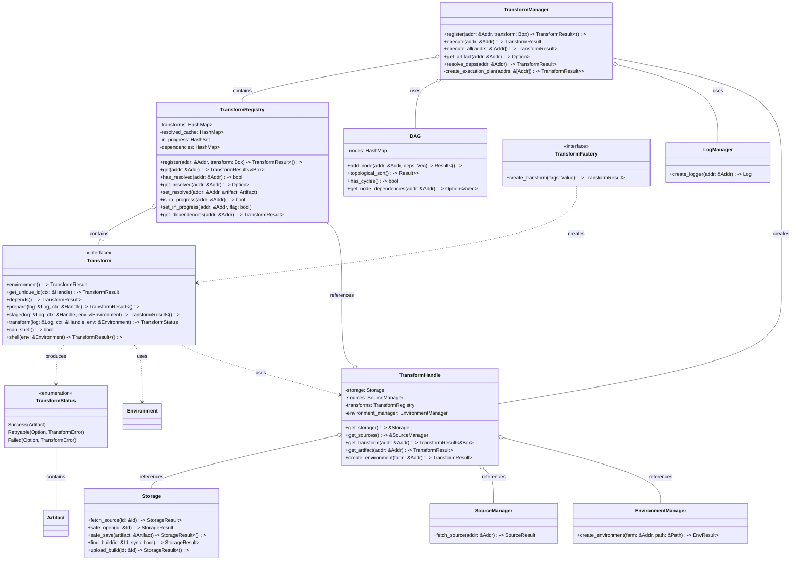

# Edo Transform Component - Detailed Design

## 1. Overview

The Transform component is the fourth and final core architectural pillar of Edo, responsible for converting input artifacts into output artifacts. This component represents the actual build operations that process source code and other artifacts to produce built outputs. Transforms work with the Storage, Source, and Environment components to provide a complete build pipeline that is both flexible and reproducible.

## 2. Core Responsibilities

The Transform component is responsible for:

1. **Artifact Transformation**: Converting input artifacts into output artifacts
2. **Dependency Management**: Tracking and resolving dependencies between transforms
3. **Build Execution**: Running build commands in configured environments
4. **Incremental Building**: Optimizing builds by skipping unnecessary work
5. **Build Caching**: Leveraging cached artifacts to speed up builds
6. **Error Handling**: Gracefully handling and reporting build failures

## 3. Component Architecture

### 3.1 Key Abstractions

#### 3.1.1 Transform

The `Transform` trait represents the core abstraction for build operations:

```rust
trait Transform {
    /// Returns the address of the environment farm to use
    fn environment(&self) -> TransformResult<Addr>;

    /// Return the transforms unique id that will represent its output
    fn get_unique_id(&self, ctx: &Handle) -> TransformResult<Id>;

    /// Returns all dependent transforms of this one
    fn depends(&self) -> TransformResult<Vec<Addr>>;

    /// Prepare the transform by fetching all sources and dependent artifacts
    fn prepare(&self, log: &Log, ctx: &Handle) -> TransformResult<()>;

    /// Stage all needed files into the environment
    fn stage(&self, log: &Log, ctx: &Handle, env: &Environment) -> TransformResult<()>;

    /// Perform the tranformation
    fn transform(&self, log: &Log, ctx: &Handle, env: &Environment) -> TransformStatus;

    /// Can a user enter a shell if this transform fails
    fn can_shell(&self) -> bool;

    /// Open a shell in the environment at the appropriate location
    fn shell(&self, env: &Environment) -> TransformResult<()>;
}
```

Key capabilities of `Transform`:
- **Environment Selection**: Specifies which environment farm to use for the build
- **Identity Management**: Generates unique identifiers for build artifacts
- **Dependency Declaration**: Defines dependencies on other transforms
- **Preparation Logic**: Fetches required sources and artifacts
- **Environmental Setup**: Stages files into the build environment
- **Build Operations**: Executes the actual build operations
- **Debugging Support**: Provides interactive shell access for troubleshooting

#### 3.1.2 TransformStatus

The `TransformStatus` enum represents the possible outcomes of a transform operation:

```rust
pub enum TransformStatus {
    Success(Artifact),
    Retryable(Option<PathBuf>, error::TransformError),
    Failed(Option<PathBuf>, error::TransformError),
}
```

Key characteristics:
- **Success**: Contains the successfully built artifact
- **Retryable**: Indicates a temporary failure that can be retried
- **Failed**: Indicates a permanent failure that cannot be retried
- **Path Information**: Optionally provides path information for debugging

#### 3.1.3 TransformHandle

The `TransformHandle` represents the context in which a transform operates:

```rust
pub struct TransformHandle {
    storage: Storage,
    sources: SourceManager,
    transforms: TransformRegistry,
    environment_manager: EnvironmentManager,
}
```

Key responsibilities:
- **Resource Access**: Provides access to core system components
- **Dependency Resolution**: Resolves transform dependencies
- **Artifact Management**: Manages artifacts created by transforms
- **Environment Creation**: Creates appropriate build environments

#### 3.1.4 TransformRegistry

The `TransformRegistry` manages transform registrations and dependencies:

```rust
pub struct TransformRegistry {
    transforms: HashMap<Addr, Box<dyn Transform>>,
    resolved_cache: HashMap<Addr, Arc<Artifact>>,
    in_progress: HashSet<Addr>,
    dependencies: HashMap<Addr, Vec<Addr>>,
}
```

Key responsibilities:
- **Transform Registration**: Tracks registered transforms by address
- **Artifact Caching**: Caches transform outputs to avoid redundant work
- **Cycle Detection**: Prevents circular dependencies in the transform graph
- **Dependency Tracking**: Maintains the dependency relationships between transforms

### 3.2 Component Structure



## 4. Key Interfaces

### 4.1 Transform Interface

```rust
/// Defines the interface that all transforms must follow
pub trait Transform: Send + Sync + 'static {
    /// Returns the address of the environment farm to use
    fn environment(&self) -> TransformResult<Addr>;

    /// Return the transforms unique id that will represent its output
    fn get_unique_id(&self, ctx: &Handle) -> TransformResult<Id>;

    /// Returns all dependent transforms of this one
    fn depends(&self) -> TransformResult<Vec<Addr>>;

    /// Prepare the transform by fetching all sources and dependent artifacts
    fn prepare(&self, log: &Log, ctx: &Handle) -> TransformResult<()>;

    /// Stage all needed files into the environment
    fn stage(&self, log: &Log, ctx: &Handle, env: &Environment) -> TransformResult<()>;

    /// Perform the tranformation
    fn transform(&self, log: &Log, ctx: &Handle, env: &Environment) -> TransformStatus;

    /// Can a user enter a shell if this transform fails
    fn can_shell(&self) -> bool;

    /// Open a shell in the environment at the appropriate location
    fn shell(&self, env: &Environment) -> TransformResult<()>;
}
```

The Transform trait is the core interface for defining build operations. The lifecycle of a transform typically follows these phases:

1. **Dependency Resolution**:
   - `depends()` returns the addresses of other transforms this transform depends on
   - The transform manager uses this to construct the build graph

2. **Preparation Phase**:
   - `prepare()` fetches required sources and artifacts
   - This happens before the environment is created

3. **Staging Phase**:
   - `environment()` determines which environment to use
   - `stage()` copies required files into the environment

4. **Execution Phase**:
   - `transform()` performs the actual build operations
   - Returns the build status and resulting artifact (if successful)

5. **Debug Phase** (on failure):
   - `can_shell()` determines if shell access is allowed
   - `shell()` provides interactive shell access for debugging

### 4.2 TransformManager Interface

```rust
pub struct TransformManager {
    registry: TransformRegistry,
    dag: DAG,
    storage: Storage,
    source_manager: SourceManager,
    environment_manager: EnvironmentManager,
    log_manager: LogManager,
}

impl TransformManager {
    /// Register a new transform with the given address
    pub fn register(&mut self, addr: &Addr, transform: Box<dyn Transform>) -> TransformResult<()> {
        // Get dependencies for this transform
        let deps = transform.depends()?;

        // Register the transform
        self.registry.register(addr, transform)?;

        // Add the node to the DAG
        self.dag.add_node(addr, deps)?;

        Ok(())
    }

    /// Execute a single transform and its dependencies
    pub async fn execute(&mut self, addr: &Addr) -> TransformResult<Artifact> {
        // Check if already resolved
        if let Some(artifact) = self.registry.get_resolved(addr) {
            return Ok((*artifact).clone());
        }

        // Create execution plan
        let plan = self.create_execution_plan(&[addr.clone()])?;

        // Execute each level of the plan in parallel
        for level in plan {
            let mut handles = Vec::new();

            for node_addr in level {
                let handle = self.execute_transform(&node_addr);
                handles.push(handle);
            }

            // Wait for all transforms at this level to complete
            let results = try_join_all(handles).await?;

            // Process results
            for (addr, result) in results {
                match result {
                    Ok(artifact) => {
                        self.registry.set_resolved(&addr, artifact);
                    },
                    Err(e) => return Err(e),
                }
            }
        }

        // Get the final result
        match self.registry.get_resolved(addr) {
            Some(artifact) => Ok((*artifact).clone()),
            None => error::MissingArtifactSnafu { addr: addr.clone() }.fail(),
        }
    }

    /// Execute multiple transforms and their dependencies
    pub async fn execute_all(&mut self, addrs: &[Addr]) -> TransformResult<HashMap<Addr, Artifact>> {
        let mut results = HashMap::new();

        // Create execution plan for all addresses
        let plan = self.create_execution_plan(addrs)?;

        // Execute each level of the plan in parallel
        for level in plan {
            let mut handles = Vec::new();

            for node_addr in level {
                // Skip if already resolved
                if self.registry.has_resolved(&node_addr) {
                    continue;
                }

                let handle = self.execute_transform(&node_addr);
                handles.push(handle);
            }

            // Wait for all transforms at this level to complete
            let level_results = try_join_all(handles).await?;

            // Process results
            for (addr, result) in level_results {
                match result {
                    Ok(artifact) => {
                        self.registry.set_resolved(&addr, artifact);
                    },
                    Err(e) => return Err(e),
                }
            }
        }

        // Collect results for requested addresses
        for addr in addrs {
            if let Some(artifact) = self.registry.get_resolved(addr) {
                results.insert(addr.clone(), (*artifact).clone());
            } else {
                return error::MissingArtifactSnafu { addr: addr.clone() }.fail();
            }
        }

        Ok(results)
    }

    /// Get a resolved artifact if available
    pub fn get_artifact(&self, addr: &Addr) -> Option<Arc<Artifact>> {
        self.registry.get_resolved(addr)
    }

    /// Resolve dependencies for a transform
    pub fn resolve_deps(&self, addr: &Addr) -> TransformResult<Vec<Addr>> {
        self.registry.get_dependencies(addr)
    }

    /// Create an execution plan for the given addresses
    fn create_execution_plan(&self, addrs: &[Addr]) -> TransformResult<Vec<Vec<Addr>>> {
        // Build a subgraph containing only the nodes reachable from addrs
        let mut subgraph = DAG::new();
        let mut visited = HashSet::new();

        // Helper function for DFS traversal
        fn visit(
            addr: &Addr,
            dag: &DAG,
            subgraph: &mut DAG,
            visited: &mut HashSet<Addr>,
        ) -> TransformResult<()> {
            if visited.contains(addr) {
                return Ok(());
            }

            visited.insert(addr.clone());

            let deps = match dag.get_node_dependencies(addr) {
                Some(deps) => deps.clone(),
                None => return error::UnknownTransformSnafu { addr: addr.clone() }.fail(),
            };

            subgraph.add_node(addr, deps.clone())?;

            for dep in deps {
                visit(&dep, dag, subgraph, visited)?;
            }

            Ok(())
        }

        // Visit all addresses
        for addr in addrs {
            visit(addr, &self.dag, &mut subgraph, &mut visited)?;
        }

        // Check for cycles
        if subgraph.has_cycles() {
            return error::CyclicDependencySnafu.fail();
        }

        // Get topological sort
        subgraph.topological_sort()
    }

    /// Execute a single transform
    async fn execute_transform(&self, addr: &Addr) -> (Addr, TransformResult<Artifact>) {
        let addr_clone = addr.clone();

        // Check if already in progress (cycle detection)
        if self.registry.is_in_progress(addr) {
            return (addr_clone, error::CyclicDependencySnafu.fail());
        }

        // Mark as in progress
        self.registry.set_in_progress(addr, true);

        // Get the transform
        let transform = match self.registry.get(addr) {
            Ok(t) => t,
            Err(e) => return (addr_clone, Err(e)),
        };

        // Create logger
        let log = self.log_manager.create_logger(addr);

        // Create transform handle
        let handle = TransformHandle::new(
            &self.storage,
            &self.source_manager,
            &self.registry,
            &self.environment_manager,
        );

        // Prepare the transform
        if let Err(e) = transform.prepare(&log, &handle).await {
            self.registry.set_in_progress(addr, false);
            return (addr_clone, Err(e));
        }

        // Get environment farm address
        let env_farm = match transform.environment().await {
            Ok(farm) => farm,
            Err(e) => {
                self.registry.set_in_progress(addr, false);
                return (addr_clone, Err(e));
            }
        };

        // Create transform directory
        let transform_dir = PathBuf::from("transforms").join(addr.to_string());

        // Create environment
        let env = match self.environment_manager.create_environment(&log, Some(env_farm), &transform_dir).await {
            Ok(env) => env,
            Err(e) => {
                self.registry.set_in_progress(addr, false);
                return (addr_clone, Err(error::EnvironmentSnafu { source: e }.build()));
            }
        };

        // Setup environment
        if let Err(e) = env.setup(&log, &self.storage).await {
            self.registry.set_in_progress(addr, false);
            return (addr_clone, Err(error::EnvironmentSnafu { source: e }.build()));
        }

        // Start environment
        if let Err(e) = env.up(&log).await {
            self.registry.set_in_progress(addr, false);
            return (addr_clone, Err(error::EnvironmentSnafu { source: e }.build()));
        }

        // Stage files
        if let Err(e) = transform.stage(&log, &handle, &env).await {
            // Try to bring down the environment
            let _ = env.down(&log).await;

            self.registry.set_in_progress(addr, false);
            return (addr_clone, Err(e));
        }

        // Perform transform
        let status = transform.transform(&log, &handle, &env).await;

        // Handle result
        let result = match status {
            TransformStatus::Success(artifact) => {
                // Try to bring down the environment
                let _ = env.down(&log).await;

                // Upload artifact to build cache if configured
                if let Err(e) = self.storage.upload_build(&artifact.config().id()).await {
                    log.warn(format!("Failed to upload to build cache: {}", e));
                }

                Ok(artifact)
            },
            TransformStatus::Retryable(path, error) => {
                // Handle retryable error - could implement retry logic here

                // For now, just fail
                log.error(format!("Transform failed with retryable error: {}", error));

                // Handle debugging if requested
                if transform.can_shell() && path.is_some() {
                    log.info("Entering debug shell...");
                    let _ = transform.shell(&env).await;
                }

                // Try to bring down the environment
                let _ = env.down(&log).await;

                Err(error)
            },
            TransformStatus::Failed(path, error) => {
                log.error(format!("Transform failed: {}", error));

                // Handle debugging if requested
                if transform.can_shell() && path.is_some() {
                    log.info("Entering debug shell...");
                    let _ = transform.shell(&env).await;
                }

                // Try to bring down the environment
                let _ = env.down(&log).await;

                Err(error)
            }
        };

        // Mark as no longer in progress
        self.registry.set_in_progress(addr, false);

        (addr_clone, result)
    }
}
```

### 4.3 WebAssembly Plugin Interface (WIT)

```wit
// transform-provider.wit
package edo:transform;

interface transform-provider {
    // Error type for transform operations
    enum transform-error {
        init-failed,
        dependency-error,
        execution-failed,
        artifact-error,
        environment-error,
        io-error,
        not-supported,
        invalid-config,
    }

    // Type alias for transform results
    type transform-result<T> = result<T, transform-error>;

    // Transform status
    enum transform-status {
        success(artifact-handle),
        retryable(option<string>, string),
        failed(option<string>, string),
    }

    // Artifact handle
    type artifact-handle = string;

    // Address type
    type addr = string;

    // Transform options
    record transform-options {
        name: string,
        description: string,
        env-farm: addr,
        debug-allowed: bool,
        parameters: list<tuple<string, string>>,
    }

    // Initialize the transform provider
    init: func(options: string) -> transform-result<_>;

    // Get transform dependencies
    get-dependencies: func() -> transform-result<list<addr>>;

    // Prepare transform
    prepare: func(sources: list<tuple<string, artifact-handle>>) -> transform-result<_>;

    // Stage files into environment
    stage: func(env-handle: string) -> transform-result<_>;

    // Execute transform
    execute: func(env-handle: string) -> transform-result<transform-status>;

    // Clean up transform resources
    cleanup: func() -> transform-result<_>;
}
```

## 5. Implementation Details

### 5.1 Graph Implementation

The execution graph implementation is critical for managing transform dependencies and efficiently scheduling builds. Edo utilizes the `daggy` crate for the underlying directed acyclic graph representation:

```rust
#[derive(Clone)]
pub struct Graph {
    graph: Dag<Arc<Node>, String>,
    batch_size: u64,
    index: BiHashMap<Addr, NodeIndex>,
}

impl Default for Graph {
    fn default() -> Self {
        Self::new(8)
    }
}

unsafe impl Send for Graph {}
unsafe impl Sync for Graph {}

impl Graph {
    pub fn new(batch_size: u64) -> Self {
        trace!(
            component = "execution",
            "creating new execution graph with batch_size={batch_size}"
        );
        Self {
            graph: Dag::new(),
            batch_size,
            index: BiHashMap::new(),
        }
    }
}
```

Key characteristics of the graph implementation:

1. **Node Representation**: Each node is an `Arc<Node>` containing the transform address and status information
2. **Bi-directional Mapping**: A `BiHashMap` maintains mappings between transform addresses and graph node indices
3. **Batch Size Control**: Configurable batch size limits the number of concurrent transforms
4. **Edge Labeling**: Edges between nodes are labeled with a string representation of the dependency relationship

The Graph implementation provides several key operations:

#### 5.1.1 Graph Construction

The `add` method recursively builds the dependency graph:

```rust
#[async_recursion]
pub async fn add(&mut self, ctx: &Context, addr: &Addr) -> Result<NodeIndex> {
    // If we already have this node don't register this
    if let Some(index) = self.index.get_by_left(addr) {
        return Ok(*index);
    }
    trace!(component = "execution", "adding execution node for {addr}");
    let transform = ctx
        .get_transform(addr)
        .context(error::ProjectTransformSnafu { addr: addr.clone() })?;
    let node_index = self.graph.add_node(Arc::new(Node::new(addr)));
    self.index.insert(addr.clone(), node_index);

    // Create edges for all the dependencies
    for dep in transform.depends().await? {
        let child = self.add(ctx, &dep).await?;
        trace!(component = "execution", "adding edge for {dep} -> {addr}");
        self.graph
            .add_edge(child, node_index, format!("{dep}->{addr}"))
            .context(error::GraphSnafu)?;
    }
    Ok(node_index)
}
```

#### 5.1.2 Source Preparation

The `fetch` method prepares all transforms by fetching their dependencies:

```rust
pub async fn fetch(&self, ctx: &Context) -> Result<()> {
    // Now we can parallel iterate to do the fetch
    let mut tasks = Vec::new();
    let ctx = ctx.get_handle();
    for node in self.graph.node_references() {
        let node = node.1.clone();
        let transform = ctx.get(&node.addr).context(error::ProjectTransformSnafu {
            addr: node.addr.clone(),
        })?;
        let id = transform.get_unique_id(&ctx).await?;
        if ctx.storage().find_build(&id, true).await?.is_some() {
            info!("skipped fetch for built entry {}", node.addr);
            continue;
        }
        let ctx = ctx.clone();
        let node = node.clone();
        // Create a logfile with just the id name for reuse during execution
        tasks.push(tokio::spawn(async move {
            let logf = ctx.log().create(format!("{id}").as_str()).await?;
            logf.set_subject("fetch");
            transform.prepare(&logf, &ctx).await?;
            info!("pulled sources and artifacts for {}", node.addr);
            drop(logf);
            Ok::<(), error::SchedulerError>(())
        }));
    }
    wait(tasks).await?;
    Ok(())
}
```

#### 5.1.3 Leaf Node Discovery

The `find_leafs` method identifies leaf nodes (nodes without dependencies) in the graph:

```rust
fn find_leafs(graph: &Dag<Arc<Node>, String>, index: &NodeIndex) -> Option<HashSet<NodeIndex>> {
    let mut leafs = HashSet::new();
    let mut count = 0;
    for node in graph.neighbors_directed(*index, Direction::Incoming) {
        if let Some(children) = Self::find_leafs(graph, &node) {
            for entry in children {
                leafs.insert(entry);
            }
        }
        count += 1;
    }
    if count == 0 {
        // if we didn't have any leaf nodes discovered by this node's children than this is a leaf node
        leafs.insert(*index);
    }
    if leafs.is_empty() {
        None
    } else {
        Some(leafs)
    }
}
```

#### 5.1.4 Graph Execution

The `run` method executes the graph in optimized order with parallelism:

```rust
pub async fn run(&self, path: &Path, ctx: &Context, addr: &Addr) -> Result<()> {
    // Check if already built
    let ctx = ctx.get_handle();
    let transform = ctx
        .get(addr)
        .context(error::ProjectTransformSnafu { addr: addr.clone() })?;
    let id = transform.get_unique_id(&ctx).await?;
    if ctx.storage().find_build(&id, false).await?.is_some() {
        info!("{addr} is already built, skipping...");
        return Ok(());
    }

    // Start with leaf nodes
    let graph = self.graph.clone();
    let start = self.index.get_by_left(addr).unwrap();
    let leafs = Self::find_leafs(&graph, start).unwrap_or_default();

    // Execution state tracking
    let handles: Arc<DashMap<NodeIndex<u32>, JoinHandle<Result<Artifact>>>> = Arc::new(DashMap::new());
    let dequeue = Arc::new(tokio::sync::Mutex::new(VecDeque::from_iter(leafs.clone())));
    let inflight = Arc::new(tokio::sync::Mutex::new(AtomicUsize::new(0)));
    let (sender, mut receiver) = tokio::sync::mpsc::channel(self.batch_size as usize);

    // Mark initial nodes as queued
    let lock = dequeue.lock().await;
    for index in lock.iter() {
        let node = self.graph.index(*index);
        node.set_queued();
    }
    drop(lock);

    // Spawn controller task to manage execution flow
    let parent_handle = handles.clone();
    let parent_inflight = inflight.clone();
    let parent_deq = dequeue.clone();
    let parent = tokio::spawn(async move {
        debug!(thread = "queue", "starting queue receiver");
        let mut failure_occured = false;

        while let Some(index) = receiver.recv().await {
            debug!(thread = "queue", "received notice that {:?} is done", index);
            let node: &Arc<Node> = graph.index(index);
            debug!(thread = "queue", "determined node to be {}", node.addr);

            // Check completion status
            if let Some(handle) = parent_handle.remove(&index) {
                debug!(thread = "queue", "waiting on the handle");
                match handle.1.await.context(error::JoinSnafu)? {
                    Ok(_) => node.set_success(),
                    Err(e) => {
                        error!("{} failed: {e}", node.addr);
                        node.set_failed();
                        failure_occured = true;
                        continue;
                    }
                }
            } else {
                // In the prebuilt case always flag success
                node.set_success();
            }

            if failure_occured {
                continue;
            }

            // Find ready children and queue them
            let mut children = graph.children(index);
            while let Some(child) = children.walk_next(&graph) {
                let mut parents = graph.parents(child.1);
                let node = graph.index(child.1);
                let mut skip = false;

                // Check if all parents are complete
                while let Some(parent) = parents.walk_next(&graph) {
                    let pnode = graph.index(parent.1);
                    if pnode.is_queued() || pnode.is_pending() {
                        debug!(thread = "queue", "parent {} still not done, {} won't be queue'd",
                               pnode.addr, node.addr);
                        skip = true;
                        break;
                    }
                }

                if skip {
                    continue;
                }

                // Queue if pending
                if node.is_pending() {
                    debug!(thread = "queue", "determined we can execute: {}", node.addr);
                    node.set_queued();
                    parent_deq.lock().await.push_back(child.1);
                } else {
                    debug!(thread = "queue", "{} is not pending", node.addr);
                }
            }

            // Update inflight count
            parent_inflight.lock().await.fetch_sub(1, Ordering::SeqCst);
        }
        Ok::<(), error::SchedulerError>(())
    });

    // Main dispatch loop
    let loop_deq = dequeue.clone();
    let loop_inflight = inflight.clone();

    // Continue until queue empty and no inflight tasks
    while !loop_deq.lock().await.is_empty() || loop_inflight.lock().await.load(Ordering::SeqCst) > 0 {
        let current = loop_inflight.lock().await.load(Ordering::SeqCst);

        // Calculate how many new tasks to dispatch (respect batch size)
        let send_amount = std::cmp::min(
            self.batch_size - current as u64,
            loop_deq.lock().await.len() as u64,
        );

        // Dispatch tasks
        for _ in 0..send_amount {
            if let Some(index) = dequeue.lock().await.pop_front() {
                let node = self.graph.index(index).clone();
                let addr = node.addr.clone();
                let path = path.to_path_buf();
                let transform = ctx.get(&addr)?;
                let id = transform.get_unique_id(&ctx).await?;
                let sender = sender.clone();

                inflight.lock().await.fetch_add(1, Ordering::SeqCst);

                // Skip if already built
                if ctx.storage().find_build(&id, false).await?.is_some() {
                    info!("{addr} is already built, skipping...");
                    sender.send(index).await.context(error::SignalSnafu)?;
                    break;
                }

                let ctx = ctx.clone();
                let node = node.clone();

                // Spawn task to execute the transform
                handles.insert(
                    index,
                    tokio::spawn(async move {
                        trace!(component = "execution", "performing transform {addr}");
                        let logf = ctx.log().create(format!("{id}").as_str()).await?;
                        node.set_running();
                        let result = Self::transform(&logf, &path, &ctx, &addr, &transform)
                            .instrument(info_span!("transforming", addr = addr.to_string()))
                            .await;
                        drop(logf);
                        sender.send(index).await.context(error::SignalSnafu)?;
                        result
                    }),
                );
            } else {
                break;
            }
        }
    }

    // Clean up and wait for completion
    drop(sender);
    parent.await.context(error::JoinSnafu)??;

    Ok(())
}
```
```

### 5.2 TransformHandler Implementation

The TransformHandler provides a context for transforms to interact with other components:

```rust
pub struct TransformHandle<'a> {
    storage: &'a Storage,
    sources: &'a SourceManager,
    transforms: &'a TransformRegistry,
    environment_manager: &'a EnvironmentManager,
}

impl<'a> TransformHandle<'a> {
    pub fn new(
        storage: &'a Storage,
        sources: &'a SourceManager,
        transforms: &'a TransformRegistry,
        environment_manager: &'a EnvironmentManager,
    ) -> Self {
        Self {
            storage,
            sources,
            transforms,
            environment_manager,
        }
    }

    pub fn get_storage(&self) -> &Storage {
        self.storage
    }

    pub fn get_sources(&self) -> &SourceManager {
        self.sources
    }

    pub async fn get_transform(&self, addr: &Addr) -> TransformResult<&Box<dyn Transform>> {
        self.transforms.get(addr)
    }

    pub async fn get_artifact(&self, addr: &Addr) -> TransformResult<Arc<Artifact>> {
        if let Some(artifact) = self.transforms.get_resolved(addr) {
            return Ok(artifact.clone());
        }

        error::MissingArtifactSnafu { addr: addr.clone() }.fail()
    }

    pub async fn create_environment(&self, farm: &Addr) -> TransformResult<Box<dyn Environment>> {
        let path = PathBuf::from("temp").join(farm.to_string());

        self.environment_manager
            .create_environment(farm, &path)
            .await
            .map_err(|e| error::EnvironmentSnafu { source: e }.build())
    }
}
```

### 5.3 Basic Transform Implementation

A basic transform implementation might look like:

```rust
pub struct CompileTransform {
    sources: Vec<Addr>,
    dependencies: Vec<Addr>,
    output_name: String,
    compiler: String,
    flags: Vec<String>,
    env_farm: Addr,
}

impl Transform for CompileTransform {
    async fn environment(&self) -> TransformResult<Addr> {
        Ok(self.env_farm.clone())
    }

    async fn get_unique_id(&self, ctx: &Handle) -> TransformResult<Id> {
        // Generate a hash based on inputs
        let mut hasher = Blake3::new();

        // Hash compiler and flags
        hasher.update(self.compiler.as_bytes());
        for flag in &self.flags {
            hasher.update(flag.as_bytes());
        }

        // Hash source artifacts
        for src in &self.sources {
            // Get source artifact
            let source = ctx.get_sources().fetch_source(src).await?;
            hasher.update(source.config().id().digest().as_bytes());
        }

        // Hash dependent artifacts
        for dep in &self.dependencies {
            let artifact = ctx.get_artifact(dep).await?;
            hasher.update(artifact.config().id().digest().as_bytes());
        }

        // Finalize hash
        let hash = hasher.finalize();

        // Create ID
        let id = IdBuilder::default()
            .name(self.output_name.clone())
            .digest(hash.to_hex().as_str())
            .build()
            .map_err(|e| error::IdSnafu { source: e }.build())?;

        Ok(id)
    }

    async fn depends(&self) -> TransformResult<Vec<Addr>> {
        Ok(self.dependencies.clone())
    }

    async fn prepare(&self, log: &Log, ctx: &Handle) -> TransformResult<()> {
        // Fetch all source artifacts
        for src in &self.sources {
            log.debug(format!("Fetching source: {}", src));
            ctx.get_sources().fetch_source(src).await?;
        }

        // Ensure all dependencies are available
        for dep in &self.dependencies {
            log.debug(format!("Checking dependency: {}", dep));
            ctx.get_artifact(dep).await?;
        }

        Ok(())
    }

    async fn stage(&self, log: &Log, ctx: &Handle, env: &Environment) -> TransformResult<()> {
        // Create source directory
        let src_dir = PathBuf::from("src");
        env.create_dir(&src_dir).await.map_err(|e| error::EnvironmentSnafu { source: e }.build())?;

        // Stage source files
        for src in &self.sources {
            log.info(format!("Staging source: {}", src));
            let source = ctx.get_sources().fetch_source(src).await?;

            // Unpack source into src directory
            let reader = ctx.get_storage().safe_read(&source.layers()[0]).await
                .map_err(|e| error::StorageSnafu { source: e }.build())?;

            env.unpack(&src_dir, reader).await
                .map_err(|e| error::EnvironmentSnafu { source: e }.build())?;
        }

        // Create lib directory
        let lib_dir = PathBuf::from("lib");
        env.create_dir(&lib_dir).await.map_err(|e| error::EnvironmentSnafu { source: e }.build())?;

        // Stage dependency artifacts
        for dep in &self.dependencies {
            log.info(format!("Staging dependency: {}", dep));
            let artifact = ctx.get_artifact(dep).await?;

            // Unpack dependency into lib directory
            let reader = ctx.get_storage().safe_read(&artifact.layers()[0]).await
                .map_err(|e| error::StorageSnafu { source: e }.build())?;

            env.unpack(&lib_dir, reader).await
                .map_err(|e| error::EnvironmentSnafu { source: e }.build())?;
        }

        Ok(())
    }

    async fn transform(&self, log: &Log, ctx: &Handle, env: &Environment) -> TransformStatus {
        // Get unique ID for output
        let id = match self.get_unique_id(ctx).await {
            Ok(id) => id,
            Err(e) => return TransformStatus::Failed(None, e),
        };

        // Check if we already have this artifact in the build cache
        match ctx.get_storage().find_build(&id, true).await {
            Ok(Some(artifact)) => {
                log.info(format!("Using cached artifact: {}", id));
                return TransformStatus::Success(artifact);
            },
            Ok(None) => {
                log.info(format!("Building artifact: {}", id));
            },
            Err(e) => {
                log.error(format!("Error checking build cache: {}", e));
            }
        }

        // Create output directory
        let out_dir = PathBuf::from("out");
        if let Err(e) = env.create_dir(&out_dir).await {
            let error = error::EnvironmentSnafu { source: e }.build();
            return TransformStatus::Failed(None, error);
        }

        // Build command
        let mut command = Command::new(log, &id, env);

        // Set up compiler flags
        let mut compile_cmd = format!("{} ", self.compiler);
        for flag in &self.flags {
            compile_cmd += &format!("{} ", flag);
        }
        compile_cmd += "-o out/output src/*.c";

        // Execute compile command
        if let Err(e) = command.run(&compile_cmd).await {
            let error = error::CommandSnafu { source: e }.build();
            return TransformStatus::Failed(Some(PathBuf::from("src")), error);
        }

        if let Err(e) = command.send(".").await {
            let error = error::CommandSnafu { source: e }.build();
            return TransformStatus::Failed(Some(PathBuf::from(".")), error);
        }

        // Create artifact from output
        let mut writer = match ctx.get_storage().safe_start_layer().await {
            Ok(w) => w,
            Err(e) => {
                let error = error::StorageSnafu { source: e }.build();
                return TransformStatus::Failed(None, error);
            }
        };

        // Read output directory into layer
        if let Err(e) = env.read(&out_dir, &mut writer).await {
            let error = error::EnvironmentSnafu { source: e }.build();
            return TransformStatus::Failed(Some(out_dir), error);
        }

        // Finish layer
        let layer = match ctx.get_storage()
            .safe_finish_layer(&MediaType::File(Compression::None), None, &writer).await
        {
            Ok(l) => l,
            Err(e) => {
                let error = error::StorageSnafu { source: e }.build();
                return TransformStatus::Failed(None, error);
            }
        };

        // Create artifact
        let artifact = ArtifactBuilder::default()
            .media_type(MediaType::File(Compression::None))
            .config(
                ConfigBuilder::default()
                    .id(id.clone())
                    .build()
                    .unwrap()
            )
            .layers(vec![layer])
            .build()
            .unwrap();

        // Save artifact
        if let Err(e) = ctx.get_storage().safe_save(&artifact).await {
            let error = error::StorageSnafu { source: e }.build();
            return TransformStatus::Failed(None, error);
        }

        // Upload to build cache
        if let Err(e) = ctx.get_storage().upload_build(&id).await {
            log.warn(format!("Failed to upload to build cache: {}", e));
        }

        TransformStatus::Success(artifact)
    }

    fn can_shell(&self) -> bool {
        true
    }

    async fn shell(&self, env: &Environment) -> TransformResult<()> {
        env.shell(&PathBuf::from(".")).await
            .map_err(|e| error::EnvironmentSnafu { source: e }.build())
    }
}
```

## 6. Security Considerations

### 6.1 Plugin Isolation

Transform plugins run in a WebAssembly sandbox, preventing direct access to the host system:

1. **Limited Capability Access**: Plugins only have access to explicitly granted capabilities
2. **Memory Isolation**: WebAssembly ensures memory isolation between plugins
3. **Environment Boundaries**: Transform operations occur within isolated environments

### 6.2 Input Validation

Transforms must validate all inputs to prevent security issues:

1. **Source Validation**: Verify source artifacts before use
2. **Command Sanitization**: Ensure commands don't contain malicious directives
3. **Path Traversal Prevention**: Validate paths to prevent directory traversal attacks

### 6.3 Resource Limits

Resource limits prevent transforms from consuming excessive resources:

1. **Execution Timeouts**: Limit maximum build time
2. **Memory Caps**: Restrict memory usage
3. **Disk Quotas**: Limit disk space usage

## 7. Error Handling

```rust
/// Type alias for transform operation results
pub type TransformResult<T> = Result<T, TransformError>;

/// Transform error types
#[derive(Debug, Snafu)]
pub enum TransformError {
    /// Dependency resolution error
    #[snafu(display("Failed to resolve dependencies for transform at {}: {}", addr, reason))]
    DependencyResolution { addr: Addr, reason: String },

    /// Cyclic dependency error
    #[snafu(display("Cyclic dependency detected in transform graph"))]
    CyclicDependency,

    /// Unknown transform error
    #[snafu(display("Unknown transform: {}", addr))]
    UnknownTransform { addr: Addr },

    /// Missing artifact error
    #[snafu(display("Missing artifact for transform: {}", addr))]
    MissingArtifact { addr: Addr },

    /// Environment error
    #[snafu(display("Environment error: {}", source))]
    Environment { source: EnvError },

    /// Storage error
    #[snafu(display("Storage error: {}", source))]
    Storage { source: StorageError },

    /// Source error
    #[snafu(display("Source error: {}", source))]
    Source { source: SourceError },

    /// Command error
    #[snafu(display("Command execution error: {}", source))]
    Command { source: EnvError },

    /// ID generation error
    #[snafu(display("ID generation error: {}", source))]
    Id { source: StorageError },

    /// Plugin error
    #[snafu(display("Plugin error: {}", reason))]
    Plugin { reason: String },

    /// I/O error
    #[snafu(display("I/O error: {}", source))]
    IoError { source: std::io::Error },
}
```

## 8. Testing Strategy

Testing for the Transform component will focus on:

1. **Unit Tests**:
   - Test dependency resolution logic
   - Verify DAG operations
   - Test transform lifecycle methods
   - Validate error handling

2. **Integration Tests**:
   - Test interaction with other components
   - Verify build cache functionality
   - Test parallel execution of transforms

3. **Performance Tests**:
   - Benchmark transform execution times
   - Test scalability with large dependency graphs
   - Measure caching effectiveness

4. **Failure Tests**:
   - Test recovery from failed transforms
   - Verify proper cleanup after failures
   - Test debuggability features

## 9. Future Enhancements

### 9.1 Remote Execution

Support for executing transforms on remote machines:

1. **Distributed Execution**: Distribute transforms across multiple machines
2. **Remote Workers**: Send transforms to dedicated worker nodes
3. **Cloud Integration**: Utilize cloud resources for transform execution

### 9.2 Enhanced Caching

More sophisticated caching mechanisms:

1. **Partial Build Caching**: Cache intermediate build products
2. **Predictive Caching**: Pre-fetch likely-needed artifacts
3. **Shared Caching**: Team-wide artifact sharing

### 9.3 Build Analysis

Advanced build analysis capabilities:

1. **Build Visualization**: Visual representation of transform dependencies
2. **Performance Profiling**: Identify bottlenecks in transforms
3. **Optimization Suggestions**: Recommend ways to speed up builds

### 9.4 Advanced Scheduling

Sophisticated transform scheduling:

1. **Priority-based Scheduling**: Prioritize certain transforms
2. **Resource-aware Scheduling**: Optimize resource utilization
3. **Adaptive Parallelism**: Dynamically adjust parallel execution based on system load

## 10. Conclusion

The Transform component is the final piece that brings together all other components in Edo. It leverages the Storage component for artifact management, the Source component for dependency acquisition, and the Environment component for build isolation. By implementing a flexible, extensible system for defining and executing build operations, it enables Edo to fulfill its promise of providing a modern, powerful build system with precise control over build environments.

The design presented here supports Edo's goals of flexibility, extensibility, and reproducibility while allowing for future enhancements in areas like remote execution and advanced caching. The Transform component's focus on dependency management and incremental building ensures that Edo can efficiently handle complex build scenarios in monorepo environments.
