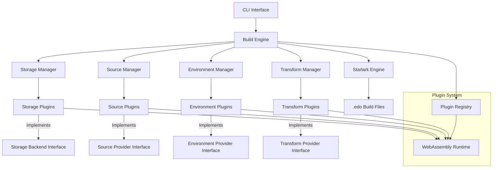

# Edo Build Tool - High-Level Design

## 1. Executive Summary

Edo is a next-generation build tool implemented in Rust that addresses critical limitations in existing build systems like Bazel, Buck2, and BuildStream. The primary innovation of Edo is its flexible approach to build environments while maintaining reproducibility. This document outlines the detailed architectural design of Edo, expanding on the four core components: Storage, Source, Environment, and Transform.

Designed for software developers building applications for platforms like Flatpak and Snap, as well as OS builders like Bottlerocket, Edo provides precise control over where and how builds execute while supporting extensibility through WebAssembly plugins. This architecture enables the creation of portable binaries with specific compatibility requirements, particularly regarding GLIBC versions, which has been a pain point in existing build tools.

## 2. Strategic Context

### 2.1 Current Limitations

Existing build tools present several limitations that impede efficient software development:

- **Rigid Environment Control**: Tools like Bazel and Buck2 don't provide sufficient flexibility in defining where builds happen and the environments around them.
- **Opinionated Artifact Management**: Current tools are too prescriptive about how external artifacts are imported into the build system.
- **Environment/Execution Coupling**: BuildStream, while better at environment control, tightly couples this with specific execution technologies like chroots and bubblewrap namespaces.
- **Binary Compatibility Challenges**: Creating binaries with specific GLIBC version compatibility requires complex workarounds in current systems.

### 2.2 Strategic Differentiators

Edo addresses these limitations through:

1. **Separation of Concerns**: Clear boundaries between build definition, environment specification, and execution mechanisms
2. **Extensibility First**: WebAssembly-based plugin system for customizing any aspect of the build process
3. **Environment Flexibility**: Support for various build environments without being tied to specific technologies
4. **Artifact-centric Design**: OCI-compatible artifact model that enables consistent handling across different storage backends

## 3. Technical Architecture

### 3.1 System Architecture Overview

Edo is designed as a modular system comprising four primary components that interact through well-defined interfaces. This modular approach enables extensibility and ensures that components can evolve independently.

### 3.2 Core Components

#### 3.2.1 Build Engine

The Build Engine is the central orchestrator of Edo that:

- Parses and evaluates Starlark build files
- Constructs the build dependency graph
- Schedules and executes build operations
- Coordinates interactions between other components

**Key Responsibilities**:
- Dependency resolution and DAG construction
- Incremental build optimization
- Plugin discovery and loading
- Build execution coordination

#### 3.2.2 Storage Manager

The Storage Manager provides a uniform interface for artifact storage and retrieval across different backends.

**Key Architectural Elements**:
- **Artifact Model**: OCI-compatible artifact structure with custom manifest
- **Content Addressing**: Blake3-based hashing for artifact identification
- **Backend Abstraction**: Pluggable interface for different storage implementations
- **Cache Management**: Handling of local and remote caches

**Storage Flow**:
1. Artifacts are uniquely identified by name and content hash
2. Content is stored as one or more layer blobs with media types
3. Manifests track metadata and relationships between artifacts
4. Backends implement the actual persistence mechanism

#### 3.2.3 Source Manager

The Source Manager handles the acquisition of external code and dependencies.

**Key Architectural Elements**:
- **Source Resolution**: Converting source declarations into concrete artifacts
- **Vendor Management**: Managing different external sources of artifacts
- **Dependency Resolution**: Resolving version constraints in "wants" declarations
- **Lock File Management**: Generating and parsing edo.lock.json files

**Source Resolution Flow**:
1. Parse source declarations from build files
2. Resolve "wants" declarations using appropriate vendor plugins
3. Generate or update lock files with concrete versions and hashes
4. Fetch source artifacts using the resolved information

#### 3.2.4 Environment Manager

The Environment Manager defines and provisions the execution contexts for builds.

**Key Architectural Elements**:
- **Environment Abstraction**: Interface for different execution environments
- **Isolation Management**: Handling network and filesystem isolation
- **Resource Control**: Managing CPU, memory, and other resources
- **Environment Setup**: Provisioning and configuring build environments

**Environment Types**:
1. **Local**: Direct execution on the host system
2. **Container**: Docker/Podman-based isolation
3. **Custom**: Plugin-based custom environments

#### 3.2.5 Transform Manager

The Transform Manager handles the core build operations that convert input artifacts to output artifacts.

**Key Architectural Elements**:
- **Transform Definition**: Declaration of inputs, outputs, and build steps
- **Dependency Tracking**: Tracking relationships between transforms
- **Execution Planning**: Determining optimal execution order
- **Build Caching**: Skipping unnecessary builds based on input hashing

### 3.3 Plugin System Architecture

Edo's plugin system is built on WebAssembly to provide a secure, language-agnostic extension mechanism.

**Key Architectural Elements**:
- **WIT Interface**: WebAssembly Interface Types definitions for plugin APIs
- **Plugin Discovery**: Declaration-based discovery in build files
- **Plugin Loading**: Runtime loading of WebAssembly modules
- **Plugin Security**: Sandboxed execution with defined capabilities

**Plugin Types**:
1. **Storage Plugins**: Implementing custom storage backends
2. **Source Plugins**: Providing acquisition from different source types
3. **Environment Plugins**: Defining custom build environments
4. **Transform Plugins**: Implementing specialized build operations

### 3.4 Build Configuration

Edo uses Starlark for build configuration to provide a familiar, deterministic language for build definitions.

**Key Architectural Elements**:
- **Starlark Engine**: Parser and evaluator for Starlark scripts
- **Built-in Functions**: Core functionality exposed to build scripts
- **Rule System**: Framework for defining build rules
- **Extension Points**: Hooks for plugins to extend the build language

## 4. Implementation Strategy

### 4.1 Core Implementation

The core of Edo will be implemented in Rust, leveraging its performance, safety, and concurrency features. The implementation will follow these principles:

1. **Component Isolation**: Clear boundaries between components through well-defined interfaces
2. **Error Handling**: Comprehensive error handling with meaningful messages
3. **Testing**: Extensive unit and integration testing
4. **Performance Optimization**: Focus on build speed and minimal overhead

### 4.2 WebAssembly Integration

The WebAssembly plugin system will be built using:

1. **wasmtime**: For WebAssembly runtime capabilities
2. **wit-bindgen**: For generating WebAssembly Interface Types bindings
3. **wasm-component-model**: For component-based WebAssembly modules

### 4.3 Build Phases

The Edo build process follows these phases:

1. **Configuration Loading**: Parse and evaluate Starlark build files
2. **Plugin Discovery**: Identify and load required plugins
3. **Dependency Resolution**: Resolve all dependencies and construct the build graph
4. **Source Acquisition**: Fetch or validate source artifacts
5. **Build Planning**: Determine the optimal build order
6. **Environment Provisioning**: Set up build environments
7. **Transform Execution**: Execute build operations in dependency order
8. **Artifact Storage**: Store build outputs in the cache

### 4.4 Development Approach

The development of Edo will follow a phased approach:

1. **Foundation Phase**: Core interfaces and minimal implementations
2. **Component Phase**: Full implementation of core components
3. **Integration Phase**: Integration of components and end-to-end testing
4. **Plugin Phase**: Implementation of plugin system and initial plugins
5. **Feature Phase**: Implementation of additional features and optimizations

## 5. Operational Considerations

### 5.1 Performance Optimization

To meet performance targets, Edo will implement:

1. **Parallel Execution**: Concurrent execution of independent build operations
2. **Incremental Builds**: Skipping unchanged portions of the build
3. **Efficient Caching**: Quick validation of cache hits
4. **Resource Management**: Optimal use of available system resources

### 5.2 Security Model

Edo's security model includes:

1. **Plugin Sandboxing**: Limiting plugin capabilities through WebAssembly
2. **Network Isolation**: Restricting network access for builds
3. **Input Validation**: Careful validation of all inputs
4. **Hash Verification**: Validating artifact integrity through hashing

### 5.3 Error Handling and Recovery

Edo will implement robust error handling including:

1. **Detailed Error Messages**: Clear indication of what went wrong
2. **Recovery Mechanisms**: Ability to continue after non-fatal errors
3. **Debugging Support**: Tools to diagnose build issues

### 5.4 Scaling Strategy

For scaling to large projects, Edo will support:

1. **Remote Execution**: Offloading builds to remote workers
2. **Distributed Caching**: Sharing build artifacts across a team
3. **Selective Building**: Building only required portions of large projects

## 6. Alternatives Analysis

Several architectural alternatives were considered during the design of Edo:

### 6.1 Build Environment Approach

**Options Considered**:
1. **Fixed Environment Types**: Predefined environment implementations
2. **Environment DSL**: Custom language for environment specification
3. **Plugin-Based Approach**: Extensible environments through plugins

**Decision**: The plugin-based approach was chosen for maximum flexibility while maintaining a consistent interface.

### 6.2 Artifact Storage

**Options Considered**:
1. **Custom Format**: Proprietary artifact storage format
2. **Standard Archive**: Using formats like tar, zip, etc.
3. **OCI Artifacts**: Using container image format for artifacts

**Decision**: OCI artifacts were chosen for their flexibility, standardization, and ecosystem support.

### 6.3 Configuration Language

**Options Considered**:
1. **Custom DSL**: Developing a domain-specific language
2. **YAML/JSON/TOML**: Using standard configuration formats
3. **Starlark**: Using the Python-like configuration language

**Decision**: Starlark was chosen for its deterministic execution, familiarity to users of other build systems, and extensibility.

## 7. Success Metrics

The success of Edo will be measured by:

1. **Build Performance**: Improved build times compared to existing tools
2. **Flexibility**: Ability to handle diverse build environments
3. **Reproducibility**: Consistency of build outputs across different environments
4. **Adoption**: Usage by target user groups (Flatpak/Snap developers, OS builders)

## 8. Future Considerations

While not in the initial implementation, these areas will be considered for future development:

1. **Remote Build Federation**: Distributing builds across multiple machines
2. **CI/CD Integration**: Deeper integration with CI/CD systems
3. **Build Visualization**: Tools for understanding build dependencies
4. **Advanced Caching Strategies**: More sophisticated approaches to artifact caching
5. **IDE Integration**: Support for common development environments
